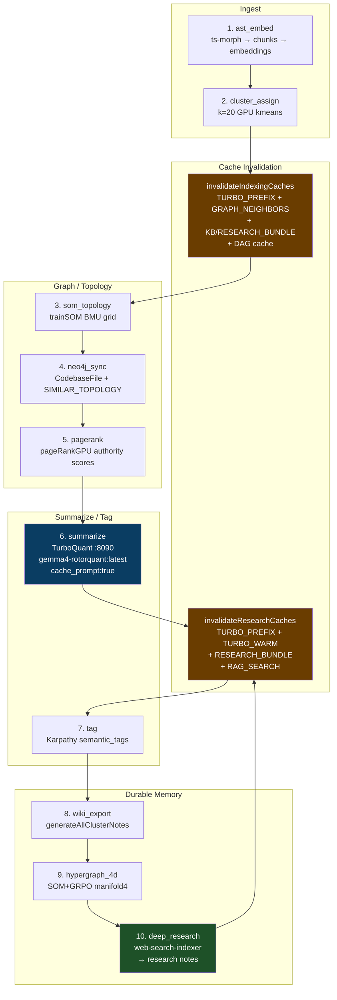

# Codebase Indexing Pipeline — How-To

End-to-end guide for the 10-stage codebase indexing pipeline with TurboQuant inference,
Karpathy wiki feedback loop, and event-driven cache invalidation.

**Last updated:** 2026-05-29 (post GDS implementation + Behavioral Supervision alignment)

---

## Architecture



---

## SourceRef-Centric Indexing

Stop thinking of the graph, vectors, and memory as separate, siloed systems. Instead, treat them as **different index views pointing to the same SourceRef**.

```
                   [ SourceRef ]
                         │
      ┌──────────────────┼──────────────────┬──────────────────┐
      ▼                  ▼                  ▼                  ▼
   [Neo4j]            [Qdrant]          [Postgres]          [Redis]
Topology Index    Semantic Index      JSONB Records       Hot Cache
      │                                                        │
      ▼                                                        ▼
   [DuckDB]                                                 [Glyph]
Auditor View                                            Reward History
```

Every piece of information revolves around the `SourceRef` identifier. The backends organize this mapping as follows:
- **Neo4j**: Relationships and topological connections between `SourceRefs`.
- **Qdrant**: High-dimensional semantic embeddings (768-dim content/signature vectors).
- **Postgres**: Raw metadata, structured columns, and raw JSONB payloads.
- **Redis**: Low-latency hot caching of transient states, intent targets, and active ACE packets.
- **DuckDB**: Fast, read-heavy analytical auditing of the indexes.
- **Glyph**: Performance history and execution reward tracking.

---

## The Behavioral Topology Layer

To transition the indexing pipeline from a static structure representation into an active agentic helper, the graph representation must expand beyond raw files (`IMPORTS` and `CALLS`). We are expanding the structural graph into a **Behavioral Topology Layer**:

### Core Node Types
- **File**: System source files and modules.
- **Function**: Declarative routines, functions, and logic blocks.
- **Feature**: End-user functional features or requirements.
- **Intent**: Classified developer intentions or queries.
- **Tool**: Executable MCP/CLI tools and commands.
- **Route**: Exposed API or page endpoints (e.g. SvelteKit route contracts).
- **Table**: Database tables, schemas, and schemas.
- **CacheKey**: Shared caches, tags, or keys (e.g. Bifrost Redis keys).
- **State**: Runtime configurations or environment variables.
- **Event**: Indexing changes, user inputs, or trace events.
- **Glyph**: Reward anchors, diagnostics, and code-synthesis quality outputs.

### Edge Types & Directives
- **Structural**: `CALLS`, `IMPORTS`, `USES_DB`, `USES_TOOL`.
- **Behavioral**: `RESOLVES_INTENT`, `TRIGGERED_BY`, `DEPENDS_ON_STATE`, `GENERATES_GLYPH`, `REWARDED_BY`, `INVALIDATED_BY`.
- **Operational**: `RETRIEVES`, `RERANKS`, `CACHES`.

---

## DuckDB: The Atlas Auditor

DuckDB is **not** used for runtime path retrieval or low-latency operations. Instead, it serves as the **Atlas Auditor**, detecting gaps and inconsistencies in our multi-backend indexing stack.

### Audit Query: Identifying Graph & Ingest Gaps
```sql
SELECT feature,
       count(*) AS unresolved_edges
FROM topology_edges
WHERE resolved = false
GROUP BY feature
ORDER BY unresolved_edges DESC;
```

### Audit Query: Finding Missing Glyphs & Unrewarded Paths
```sql
SELECT sourceRef
FROM calls_edges
LEFT JOIN glyph_records
ON calls_edges.sourceRef = glyph_records.source_ref
WHERE glyph_records.source_ref IS NULL;
```

These queries instantly reveal:
1. Features not yet indexed.
2. Code files without embeddings.
3. Disconnected nodes or gaps in the GDS projection.
4. Orphaned `SourceRefs`.
5. Dead/unused imports.
6. Dormant or unused tools.

---

## GPU Scaling Pipeline (cuJSON & cuDF)

For normal indexing runs, NodeJS parsing handles the JSONL streams. However, as retrieval loops, tool traces, glyph rewards, and synthetic runs scale into the millions, CPU serialization becomes a major bottleneck.

Our future scale architecture shifts parsing directly to the GPU:
```
[JSONL Data] ──► [cuJSON Parser] ──► [GPU Memory (cuDF Dataframe)] ──► [Embedding Engine] ──► [Qdrant]
```
This optimization eliminates:
- CPU parsing bottlenecks.
- Costly PCIe memory copies between CPU and GPU.
- NodeJS/Python thread overhead.

---

## Protocol & Interaction Layer Definitions

To keep terminology aligned, here are the distinctions between our formats, protocols, and APIs:

| Technology | Role | Representation / Example |
|---|---|---|
| **JSON** | Raw, stateless data serialization. | `{"query": "find dependencies"}` |
| **JSONB** | PostgreSQL binary JSON storage allowing deep querying and indexing. | `record_json->>'intent'` |
| **JSON-RPC 2.0** | Stateless, light remote procedure call transport format. | `{"jsonrpc": "2.0", "method": "tools/call", "params": {}}` |
| **MCP** | Model Context Protocol. A standardized client-server protocol built over JSON-RPC. | Gemma4 ──► OpenCode ──► MCP Client ──► atlas-tools-mcp |
| **Gemma4 Tool Calling** | LLM-driven intent matching where Gemma selects tools, which are executed by the local client runtime. | `{"tool": "find_dependencies", "args": {"sourceRef": "server.ts"}}` |

*Note: The model never runs code itself; it produces structured arguments that the local client runtime intercepts and executes.*

---

## Engram: Memory Orchestration

Engram does **not** replace the storage layer. It sits above the databases as a memory orchestrator:

- **Qdrant**: Stores vector embeddings for fast semantic cosine lookup.
- **Neo4j**: Stores topological relationships, communities, and authority scores.
- **Engram**: Orchestrates the memory lifecycle. It tracks retrieval traces, tool invocation logs, user decisions, reward values, and graph version history.

---

## Stage Reference

| # | Stage | Implementation | Output |
|---|---|---|---|
| 1 | `ast_embed` | ts-morph batched `addSourceFilesAtPaths` + embeddinggemma | `codebase_chunk_index` + Qdrant `codebase_chunks_768` |
| 2 | `cluster_assign` | `kmeansWithCentroids` on 768-dim embeddings | `gpu_cluster` column on every chunk |
| 3 | `som_topology` | `trainSOM` builds 2D BMU grid + `SIMILAR_TOPOLOGY` adjacency | SOM grid coords written to Qdrant payload |
| 4 | `neo4j_sync` | Merge `CodebaseFile` nodes + edges | Neo4j graph ready for recommendations |
| 5 | `pagerank` | `pageRankGPU` (CUDA) or JS fallback | `page_rank_score` authority column |
| 6 | `summarize` | TurboQuant → `summarize-clusters-pg.ts` | `cluster_summaries` + Redis `summary:cluster:*` |
| 7 | `tag` | `/api/codebase-index/karpathy-tag` | `semantic_tags[]` on every chunk |
| 8 | `wiki_export` | `generateAllClusterNotes` → CouchDB + Redis | Durable cluster notes (Karpathy wiki) |
| 9 | `hypergraph_4d` | `buildHypergraph4D` writes `manifold4` column | `[som_x, som_y, semantic_z, grpo_w]` |
| 10 | `deep_research` | `runDeepResearchIndex` + `web-search-indexer` | Web results → Qdrant `knowledge_base` + research notes |

**Invalidation fires** at Stage 2 (indexing_complete — clears all downstream),
Stage 6 (research_update — refreshes summaries), and Stage 10 (research_update — refreshes research bundles).

---

## Running the Pipeline

### Full pipeline (SSE-streamed)

```bash
# From sveltekit-frontend/
curl -N -X POST http://localhost:5173/api/codebase-index/orchestrate \
  -H "Content-Type: application/json" \
  -d '{
    "stages": ["ast_embed","cluster_assign","som_topology","neo4j_sync","pagerank","summarize","tag","wiki_export","hypergraph_4d","deep_research"],
    "summarize": true,
    "deepResearch": true,
    "exportWiki": true
  }'
```

SSE events stream back as `{ stage, status, message, progress }` so the admin page
can render a live progress bar.

---

## TurboQuant Setup (Inference Layer)

TurboQuant's `cache_prompt: true` computes the system-prompt KV state **once** and
reuses it across all 20 cluster summaries, saving ~18s per run on an 8GB GPU.

| Port | Service | Model | VRAM |
|---|---|---|---|
| `8090` | llama-server.exe (TurboQuant) | `gemma4-rotorquant:latest.gguf` + `mmproj-BF16.gguf` | 5.8 GB |
| `11434` | Ollama (fallback) | `gemma4-rotorquant:latest` | legacy swappable lane |

Start TurboQuant via VS Code task: **⚡ TurboQuant: Start (vision + text, :8090)**

Health check: `curl http://127.0.0.1:8090/health` → `{"status":"ok"}`

---

## Cache Invalidation Cascade

| Trigger | Function | Patterns Cleared |
|---|---|---|
| `cluster_assign` completes | `invalidateIndexingCaches()` | `turbo:prefix:*`, `turbo:warm:*`, `turbo:dym:*`, `graph:case:*:neighbors`, `kb_bundle:*`, `research_bundle:*`, `summary:cluster:*`, `rag:search*`, `llm:semantic:*` + CouchDB `dag_cache` purge |
| `summarize` completes | `invalidateResearchCaches()` | `turbo:prefix:*`, `turbo:warm:*`, `research_bundle:*`, `kb_bundle:*`, `rag:search*` |
| `deep_research` completes | `invalidateResearchCaches()` | (same as above — refreshes TurboQuant prefix anchors that embed research summaries) |

---

## The Next Atlas Milestones: Behavioral Supervision

Rather than focusing on building UI changes or generating more embeddings, the next phase focuses on **Behavioral Supervision**: answering *why* specific tools were selected, *why* particular `SourceRefs` were returned, and *when* decisions become stale.

### Execution Roadmap Priority
1. **`USES_DB` Extraction**: Map all direct schema and database dependencies to `SourceRefs`.
2. **`USES_TOOL` Extraction**: Standardize the extraction of tool dependencies and schemas across codebase paths.
3. **Runtime Intent Graph**: Track query intent changes over the course of multi-turn sessions.
4. **Graph Mutation Ledger**: Build a transactional audit log of structural codebase edits.
5. **Synthetic Trace Simulator**: Generate fake execution and search paths to run offline tool validation.
6. **Glyph Reward Computation**: Calculate performance scores based on the usefulness of context and tool results.
7. **Training Pair Generation**: Export state-action pairs (decisions & outcomes) to build fine-tuning datasets.
8. **LoRA Training**: Run local parameter-efficient fine-tuning on Gemma4 to automate optimal tool and context selection.

---

## Related Files

| Path | Role |
|---|---|
| `src/routes/api/codebase-index/orchestrate/+server.ts` | Pipeline orchestrator (SSE) |
| `src/lib/server/cache/invalidation.ts` | Cache cascade functions |
| `src/lib/server/cache/dag-cache.ts` | CouchDB DAG ordering cache + purge |
| `src/lib/server/indexer/karpathy-wiki.ts` | Wiki note authors (cluster/research/playbook/retrieval) |
| `src/lib/server/indexer/web-search-indexer.ts` | Deep research (Stage 10) |
| `src/lib/server/retrieval/orchestrator.ts` | Main RAG orchestrator (w/ LangExtract GRPO reranker) |
| `src/lib/server/retrieval/langextract-reranker.ts` | 3-pass entity + section + retrieval fusion |
| `scripts/summarize-clusters-pg.ts` | Standalone summarizer w/ TurboQuant-first inference |
