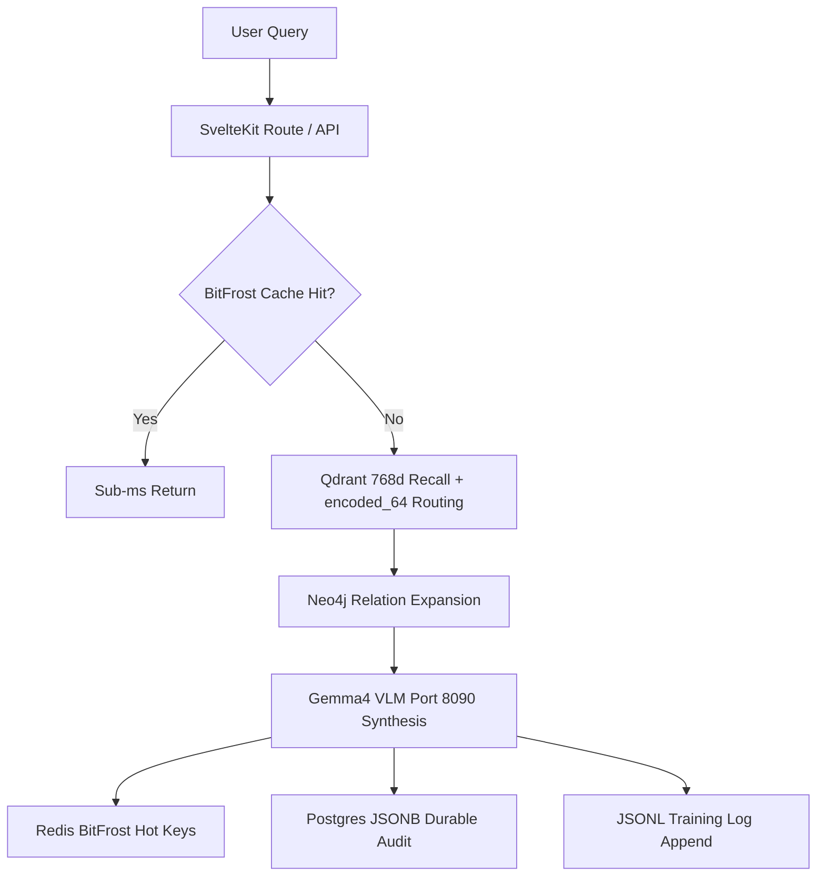

# LLM Synthesis & ACE-KAG Memory Policy
*YoRHa Legal-AI Platform — Phase 11 Architectural Standard*

## 1. Executive Summary

This policy governs the retention, representation, and transformation of context, tool execution events, and neural search payloads within the Deeds Web App. It establishes strict boundaries for the storage of intermediate model representations, defines hot vs. durable storage roles, and maps out the telemetry and training loop integration paths.

---

## 2. Storage Boundaries & Hygiene

To maintain security compliance, system integrity, and low VRAM footprint on target accelerators (e.g., RTX 3060 Ti with 8GB VRAM), we enforce a strict **no-hidden-thought** and **no-tensor-retention** policy.

### 2.1 Forbidden Data Classes
The following data categories **MUST NOT** be persisted in any storage layer:
*   `hiddenThoughts` / `chainOfThought` (raw reasoning tokens generated before final tool selection or output)
*   `kv_cache` (model key-value cache states)
*   `tensor` (raw floating-point weights, embeddings, or intermediates)
*   `cudaPointer` / `cudaMemoryAddress` (GPU memory offsets or handles)

### 2.2 Authorized Data Classes
The following structured logging attributes are authorized and **MUST** accompany every synthesis record:
*   `runId`: Globally unique request/session trace identifier.
*   `query`: Raw user prompt or query.
*   `profile`: Active retrieval profile (`code_debug`, `legal_opinion`, `fact_check`).
*   `acePacket`: Grounded topological context packet built from validated sources.
*   `toolCalls`: JSON-serialized list of tool executions, including arguments and return status.
*   `sourceRefs`: Clickable file or document links mapping directly to the canonical Docs Atlas.
*   `trustTier`: Validation certainty rank (`local_code` > `official_docs` > `external_unverified`).
*   `cacheKeys`: Identifiers of Redis exact/semantic cache entries queried.
*   `model`: Active model name/tag (e.g., `Gemma4/TurboQuant` on Port 8090).

---

## 3. Poly-Storage Layer Mapping

The Deeds Web App implements a multi-tier memory hierarchy to optimize for both sub-millisecond retrieval latency and long-term diagnostic training value.

### 3.1 Qdrant Vector Databases
*   **768 Dimensions (`canonical_recall`)**: Stores official documentation, repository-local codebase indices, and semantic anchors. This is the source of truth for RAG similarity matches.
*   **384 Dimensions (`compact_routing`)**: Stores compressed named vectors, exact match boundaries, and som embeddingemma embeddings. Used solely for routing decisions, not as a truth layer.

### 3.2 Neo4j Graph Database
*   Maintains the **KAG-DAG** topological map. Holds semantic associations, class/file dependency graphs, and multi-hop relation weights.

### 3.3 Redis / BitFrost Hot Cache
*   **Purpose**: Ephemeral, high-throughput caching of query cards, active ACE packets, and exact/semantic search outputs.
*   **Hot Key Namespaces**:
    *   `bifrost:exact:{sha256}` (1h TTL)
    *   `bifrost:semantic:{embedding_hash}` (1h TTL)
    *   `ace:packet:{runId}` (15m–60m TTL)
    *   `ace:cluster:{clusterId}` (6h–24h TTL)
*   **Rebuildability Constraint**: Redis is strictly a temporary acceleration layer. **ALL** hot entries must be 100% rebuildable from underlying database records (PostgreSQL or Qdrant) in the event of cache eviction or node failure.

### 3.4 PostgreSQL Durable Audit Store
*   **Table**: `llm_synthesis_events`
*   **Purpose**: Immutable transaction-level tracking of system decisions, validation failures, and user feedback. Stores the grounded facts that supported the LLM's final response.

### 3.5 JSONL Append-Only Log
*   **Location**: `memory/datasets/llm_synthesis/YYYY-MM-DD.jsonl`
*   **Purpose**: Offline evaluation, reinforcement learning from user feedback (RLAIF), and lane-routing model training. Serves as a persistent audit log optimized for high-volume file ingestion.

---

## 4. LibTorch Boundaries

*   **Allowed Roles**: LibTorch is strictly reserved for GPU-accelerated mathematical and tensor evaluations.
    *   Re-ranking candidate search results (`HyperRagFusionService`).
    *   Calculating similarity matrices and cluster cohesion quality.
    *   Dimensionality compression (autoencoder/PCA projection).
*   **Disallowed Roles**: Do not use LibTorch to handle general database caching, string management, or raw API response storage.

---

## 5. Telemetry & Tele-Tracing Pipeline

1.  **Request Initiation**: Client sends a query. SvelteKit middleware assigns a unique `run_id` and trace context.
2.  **Tool-Calling Hooks**: All downstream tools (`ace.route_query`, `qdrant.search_768`, `neo4j.expand_graph`) record their invocation payload and time under the current `run_id`.
3.  **Synthesis Recording**: The response generated by the Gemma4/TurboQuant pipeline is stored durably via a postgres hook and appended to the daily JSONL file.
4.  **Audit Enforcement**: The contract auditor evaluates table structure and hygiene weekly, ensuring the sidecar migrations, model outputs, and vector indexes remain fully in sync.
