# Offline Synthesis Parent Atlas

This lane turns the current corpus into structured offline artifacts before promotion. It is intentionally separate from live retrieval, but it uses the same storage spine and naming conventions.

## Canonical flow

```mermaid
flowchart LR
  A["Bounded batch ingest"] --> B["Gemma4 summarization"]
  B --> C["DuckDB mirror refresh"]
  C --> D["MapReduce consolidated index"]
  D --> E["DuckDB materialization"]
  E --> F["Phase 19C consolidation payloads"]
  F --> G["Qdrant / Neo4j sync prep"]
  G --> H["Parent atlas export"]
  H --> I["Parent atlas validation"]
  I --> J["Consistency audit"]
  J --> K["Engram / NES token remap"]
```



## Entry point

Use the dedicated orchestrator:

```powershell
npm run atlas:offline:synthesis -- --apply --limit 1000
```

Bounded preview:

```powershell
npm run atlas:offline:synthesis -- 1000
```

Bounded apply:

```powershell
node scripts/atlas/run-offline-synthesis.mjs --apply --limit 25
```

Environment override:

```powershell
$env:OFFLINE_SYNTHESIS_LIMIT='1000'; npm run atlas:offline:synthesis -- --apply
```

Direct Node invocation still supports explicit flags:

```powershell
node scripts/atlas/run-offline-synthesis.mjs --dry-run --limit 1000
```

## What the runner does

The orchestrator at `scripts/atlas/run-offline-synthesis.mjs` sequences:

1. `scripts/atlas/batch-offline-ingest.mjs`
2. `scripts/opencode/summarize_cards_gemma4.mjs`
3. `scripts/atlas/mapreduce-consolidated-index.mjs`
4. `scripts/atlas/materialize-mapreduce-duckdb.mjs`
5. `scripts/atlas/materialize-hidden-packet-pathmap-duckdb.mjs`
6. `npm run duckdb:feature-cards:refresh`
7. `scripts/atlas/phase-19c-knowledge-consolidation.mjs`
8. `scripts/atlas/phase-19c-qdrant-index.mjs`
9. `scripts/atlas/phase-19c-neo4j-sync.mjs`
10. `scripts/atlas-parent-indexing.mjs`
11. `scripts/atlas/validate-parent-atlas.mjs`
12. `scripts/atlas/audit-parent-atlas-consistency.mjs`

## Storage targets

### Postgres

Offline synthesis writes and promotes durable records into:

- `task_semantic_packets`
- `parent_atlas_records`
- `parent_atlas_vectors`
- `glyph_records`
- `tensor_analysis_cache`

`task_semantic_packets` is the narrow task mirror. The offline writer now carries
`alias_id` in the packet payloads and will persist it into Postgres when the live
table has the column. The sidecar schema already defines `alias_id text` for the
future migration path, but the live table still needs that migration before the
column is authoritative.

### Qdrant

The batch lane mirrors semantic slices into:

- `feature_maps`
- `codebase_chunks_768`

### Redis

The hot retrieval/cache path stays in:

- `ace:ctx:*`
- `ace:packet:latest`
- centroid and SOM cache keys

## Retrieval order

Use this order when consuming the artifacts:

1. Redis exact cache and hot keys
2. Qdrant semantic collections
3. Postgres durable tables
4. Neo4j / SOM topology lanes

## Outputs

The runner writes the following artifacts:

- `.tmp/offline-synthesis/consolidated-index.ndjson`
- `.tmp/offline-synthesis/consolidated-index.ndjson.manifest.json`
- `docs/reports/hidden-packet-pathmap.duckdb`
- `docs/reports/hidden-packet-pathmap-duckdb-report.json`
- `docs/reports/hidden-packet-pathmap-duckdb-report.md`
- `docs/reports/offline-synthesis-mapreduce-duckdb-report.json`
- `docs/reports/offline-synthesis-mapreduce-duckdb-report.md`
- `.tmp/ingest/lanes/codebase_features.ndjson`
- `.tmp/ingest/edges/codebase_features_edges.ndjson`
- `memory/exports/parent-atlas/parent_atlas_index.csv`
- `memory/exports/parent-atlas/parent_atlas_index.json`
- `memory/exports/parent-atlas-report.json`
- `docs/phase100/feature-recommendations.md`
- `docs/phase100/feature-recommendations.json`
- `.tmp/offline-synthesis-report.json`
- `.tmp/offline-synthesis-report.md`

The hidden packet pathmap DuckDB report is the canonical joined replay surface for the `sourceRef + feature_id + stable_id` spine. Keep it in the bounded offline lane so the pathmap stays aligned with the packet, kanban, and todo surfaces instead of drifting into a separate ad hoc report.

## Open lanes

The lane is bounded, not magically complete. The remaining work is still:

- full NDJSON / DuckDB / LangExtract rerun promotion
- token-card remapping for Engram / ACE / NES
- optional GPU/autoencoder refinement where benchmarks justify it

## Rule

Do not promote this lane into the live retrieval path without the validation step passing. The offline synthesis artifacts are input to the parent atlas and memory pipelines, not a replacement for them.
