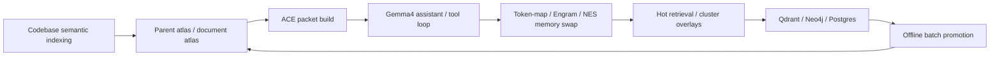

# Unified ACE / Engram / NES Pipeline

This document ties together the current codebase semantic indexing, ACE packet generation, autoencoder backfill, Engram token memory, and Gemma4/OpenCode assistant path.

Offline batch promotion is documented separately in `docs/architecture/offline-synthesis-parent-atlas.md`.

Use the current working order as the contract boundary:
BM25 + concept activation -> deeds/engram optional adapter ->
XGBoost formal reranker -> Neo4j contextual trees + HyperRAG packet RPC ->
Autoencoder / SOM latent topology -> native GEMM deferred.

Decision docs:
- `docs/atlas/parent-atlas-storage-decision.md`
- `docs/atlas/xgboost-reranker-contract.md`
- `docs/atlas/native-gemm-deferral.md`

## Canonical flow

## Live components

### 1. Codebase semantic indexing

Current entry points:
- `scripts/build-atlas-index.mjs`
- `scripts/atlas/build-parent-master-atlas.ts`
- `scripts/atlas-parent-indexing.mjs`
- `scripts/atlas/mapreduce-consolidated-index.mjs`
- `scripts/atlas/build-all-lanes-parent-atlas.mjs`

Responsibilities:
- scan codebase and docs
- derive parent atlas metadata
- generate code/document semantic signals
- keep JSON/JSONB schema evidence available for audits

### 2. ACE packet generation

Current entry points:
- `scripts/ace/build-packet.mjs`
- `scripts/ace/ask-gemma4.mjs`
- `src/lib/server/ace/context-assembler.ts`
- `src/lib/server/ai/ace-prompt-preflight.ts`

Responsibilities:
- build compact prompt packets
- preserve sourceRefs, cluster tags, and retrieval traces
- keep generation preflight deterministic

### 3. Autoencoder / GPU lane

Current entry points:
- `scripts/autoencoder-backfill-qdrant.mjs`
- `scripts/autoencoder-centroids.mjs`
- `scripts/ae-encode-to-redis.mjs`
- `simd-bridge/cpp/cuda_graph_bridge.cu`
- `simd-bridge/cpp/pytorch_graph_fp16.cc`

Responsibilities:
- maintain 768d -> latent -> centroid representations
- support GPU acceleration where available
- keep CPU / fallback behavior intact

### 4. Engram / NES token memory

Current entry points:
- `src/lib/gpu/nes-memory-architecture.ts`
- `src/lib/server/search/engram-bigram.ts`
- `scripts/atlas/sync-engram-memory.mjs`
- `scripts/atlas/engram-plugin-adapter.mjs`
- `src/lib/server/token-map/token-map-service.ts`

Responsibilities:
- keep token-map / Engram memory hot
- provide memory swaps for assistant routing
- preserve NES-style memory buckets and cluster overlays

### 4b. RabitQ variance lane

`RabitQ` is not a repo symbol today. It is the shorthand used here for the variance-ranked retrieval lane that already exists in code:
- `src/lib/server/analytics/search-analytics.ts` for query variance pairs and Bifrost variance scoring
- `src/lib/server/ace/variance-recovery.ts` for semantic variance recovery
- `src/lib/server/retrieval/hypergraph-routing-service.ts` for hot-set merge routing
- `scripts/karpathy-qdrant-cluster-backfill.ts` and `scripts/karpathy-publish-split.ts` for cluster payload promotion/backfill
- `src/lib/server/ace/engram-bigram.ts` for query-conditioned biasing

Responsibilities:
- rank retrieval by variance and hotness
- bias assistant memory swaps with Engram and cluster overlays
- keep the Qdrant / Redis / Postgres lane aligned with the assistant packet

### 5. Gemma4 / OpenCode assistant

Current entry points:
- `src/lib/server/llm/gemma4-tool-loop.ts`
- `src/lib/server/retrieval/hyperrag-fusion-service.ts`
- `scripts/opencode/bootstrap-workspace.mjs`
- `scripts/ace/ask-gemma4.mjs`

Responsibilities:
- use the compact ACE packet
- route through existing tool calling / retrieval layers
- avoid bypassing the memory spine

## Optional / experimental lanes

These are not the canonical runtime path:
- cuVS / CAGRA ANN
- Rust tokio sidecar
- full native N-API / napi-rs migration
- browser-only WebGPU lanes

They are useful for later optimization, but they remain downstream of the canonical ACE / Engram / NES path until benchmarked and promoted.

## Publish split rule

Only code-bearing slices should enter the first-pass publish flow.

Exclude from first-pass publish:
- generated atlas / graph artifacts
- large tokenizer / model payload churn
- broad planning or TODO churn
- manual sidecar SQL that is already documented and audit-only

## Practical rule

If a lane does not affect:
- codebase semantic indexing,
- ACE packet construction,
- Engram / token-map memory swaps, or
- Gemma4 tool routing,

then it should stay outside the canonical assistant path until promoted.
