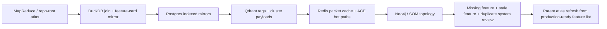

# Missing Features Path Map

This note is the quick-traversal surface for the missing-features / TODO / archive analysis lane.
It links the mapreduce outputs, DuckDB joins, Postgres mirror tables, and the retrieval stores that
carry `sourceRef`, `feature_id`, and `alias_id` across the stack.

## Canonical inputs

- `docs/graph/repo-root-atlas.md`
- `docs/graph/repo-root-atlas.json`
- `docs/graph/kanban-board.json`
- `docs/reports/feature-gap-registry-live-latest.json`
- `docs/reports/qdrant-source-refs-backfill-latest.json`
- `docs/reports/feature-card-duckdb-validation.json`
- `docs/reports/feature-card-duckdb-inspect.json`
- `memory/exports/parent-atlas/parent_atlas_index.json`
- `.tmp/offline-synthesis-report.json`
- `.tmp/mapreduce-full-v4.ndjson`
- `.tmp/mapreduce-full-v4.ndjson.manifest.json`

## Repo traversal roots

1. `sveltekit-frontend/src/lib/server/db/schema/`
2. `sveltekit-frontend/drizzle/manual/`
3. `scripts/atlas/`
4. `scripts/ingest/`
5. `docs/graph/`
6. `docs/reports/`
7. `docs/atlas/`
8. `memory/exports/`
9. `.tmp/`
10. `.opencode/`
11. `.cache/`
12. `.svelte-kit/`
13. `.github/`
14. `.vscode/`

## Analysis chain

## Field alignment

- `sourceRef` = canonical source identity for traversals
- `feature_id` = stable feature lane / registry identity
- `alias_id` = cross-store alias for task / packet / profile reconciliation
- `parent_atlas_card_id` = offline synthesis / card-level atlas identity
- cluster aliases to treat as equivalent when reconciling Qdrant payloads:
  - `cluster_id`
  - `cluster_key`
  - `gpu_cluster`
  - `gpuCluster`
  - `som_cluster`
  - `topology_label`

## Where to look first

- Missing feature rows:
  - `docs/reports/feature-gap-registry-live-latest.json`
- SourceRef-prefix clusters:
  - `docs/reports/qdrant-source-refs-backfill-latest.json`
- DuckDB validation / inspect:
  - `docs/reports/feature-card-duckdb-validation.json`
  - `docs/reports/feature-card-duckdb-inspect.json`
- Offline synthesis apply slices:
  - `.tmp/ingest/lanes/codebase_features.ndjson`
  - `.tmp/ingest/edges/codebase_features_edges.ndjson`
- Parent atlas output:
  - `memory/exports/parent-atlas/parent_atlas_index.json`

## Operational rule

Treat this lane as read-mostly until archive decisions land. Promote only the validated outputs into
Postgres, Qdrant, Redis, Neo4j / SOM topology, and SeaweedFS. Keep the raw summary artifacts outside
the repo when they become long-lived outputs.
