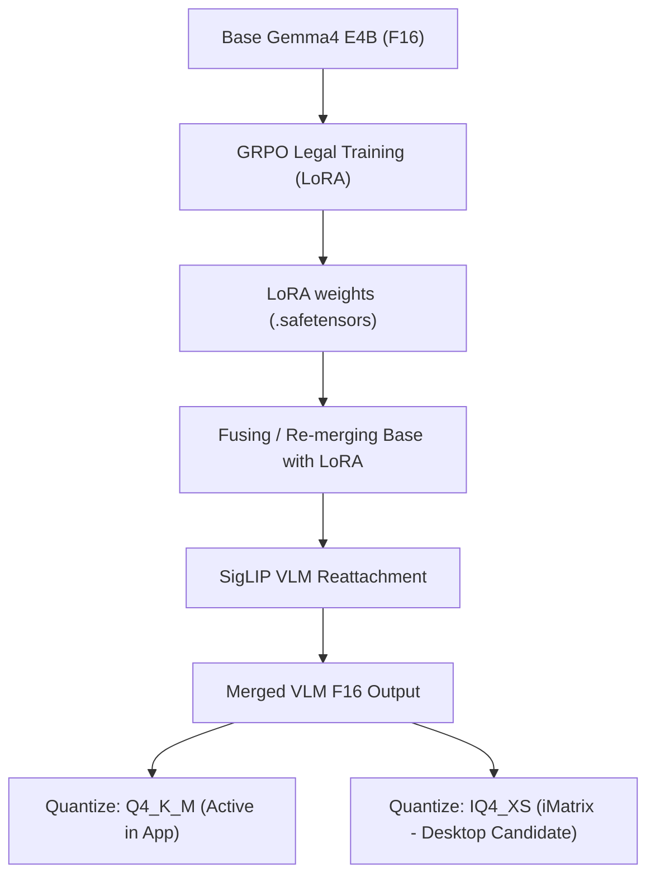

# GGUF Model Lanes & Wiring Inventory

This document details the configuration, active wiring, and disk inventory of the GGUF large language models (LLMs) and vision language models (VLMs) used in the **Deeds Web App**.

---

## 🗺️ Architectural Mapping & Active Wiring

The Deeds Web App utilizes a local, high-performance CUDA inference pipeline via `llama-server.exe` to drive legal reasoning and document analysis. The model configuration is loaded via environment variables defined in the root `.env` file:

```ini
# Active Model Variables (.env)
TURBO_MODEL_PATH=C:\Users\james\Videos\deeds-web-app\vendor\models\gemma4-legal.gguf
TURBO_MMPROJ_PATH=C:\Users\james\Videos\deeds-web-app\vendor\models\mmproj-gemma4.gguf
LLAMA_SERVER_PATH=C:\Users\james\Desktop\llama-server-cuda\llama-server.exe
TURBO_PROFILE=stock
TURBO_CTX=16384
TURBO_NGL=99
```

### 🧱 Component Breakdown
1. **Model Core (`gemma4-legal.gguf`)**: A **Gemma4 E4B (4.4B)** base model merged with a specialized **GRPO (Group Relative Policy Optimization)** fine-tuned legal LoRA. Quantized in **Q4_K_M** (5.33 GB) format on disk.
2. **Vision Tower (`mmproj-gemma4.gguf`)**: A multimodal projector file (991 MB) based on **SigLIP** enabling image inputs and OCR capabilities when the VLM projector tower is active.
3. **Execution Context (`llama-server-cuda`)**: Runs with complete GPU offloading (`--n-gpu-layers 99`) and a 16k tokens context window (`--ctx-size 16384`).

---

## 🗄️ Model Inventory on Disk

### 1. Active App Vendor Directory (`vendor/models/`)
* Located at: `C:\Users\james\Videos\deeds-web-app\vendor\models\`

| File / Subfolder | Size | Created | Status / Purpose |
| :--- | :--- | :--- | :--- |
| `gemma4-legal.gguf` | 5.0 GB | Apr 5, 2026 | **ACTIVE**. The primary merged GRPO legal text-reasoning model. |
| `mmproj-gemma4.gguf` | 946 MB | Apr 11, 2026 | **ACTIVE**. Multimodal visual projector (SigLIP). |
| `lora/gemma4-legal-grpo/` | 169 MB | May 16, 2026 | **Archived**. Contains the raw `.safetensors` GRPO LoRA weights (incompatible with direct `llama-server --lora` execution, pre-baked into the main GGUF). |
| `lora/gemma4-legal-text/` | 143 MB | May 16, 2026 | **Archived**. Contains raw `.safetensors` text LoRA weights. |

---

### 2. Desktop Model Inventory (`Desktop/gemma4-legal-iq4xs/`)
* Located at: `C:\Users\james\Desktop\gemma4-legal-iq4xs\`

This directory acts as the pipeline export and quantization workspace for E4B Legal models.

| File Name | Size | Quantization | Recommendation / Utility |
| :--- | :--- | :--- | :--- |
| `gemma4-legal-iq4xs.gguf` | 4.8 GB | **IQ4_XS** (iMatrix) | **KEEP / RECOMMEND UPGRADE**. Features importance matrix calibration. Saves ~200MB VRAM over Q4_K_M while matching or exceeding token quality. |
| `gemma4-legal-iq4xs-direct.gguf` | 4.8 GB | **IQ4_XS** (Direct) | **DELETE / DUPLICATE**. A redundant direct quantization pass without iMatrix calibration. |
| `gemma4-legal-merged-q4km.gguf` | 5.0 GB | **Q4_K_M** | **DELETE / DUPLICATE**. This is the exact original merged model that was copied to the app vendor folder under the name `gemma4-legal.gguf`. |
| `gemma4-legal-f16.gguf` | 68 MB | F16 | **DELETE**. A leftover testing or lightweight metadata export artifact. |
| `gemma4-legal-f16-test.gguf` | 68 MB | F16 | **DELETE**. Leftover testing artifact from the export pipeline. |

---

## 🛠️ Merge & VLM Reattachment Workflow

Based on the Jupyter notebook assets found on the desktop, the model was generated using the following end-to-end pipeline:



---

## 💡 Key Action Items & Recommendations

1. **VRAM Safety Upgrade**:
   Swap the active `gemma4-legal.gguf` in `vendor/models/` from **Q4_K_M** (5.0 GB) to the newer **IQ4_XS (iMatrix)** variant `gemma4-legal-iq4xs.gguf` (4.8 GB).
   * *Benefit*: Reduces workstation VRAM foot-print by **~200 MB** which is critical for our 8GB RTX 3060 Ti limits, while improving inference perplexity via iMatrix calibration.
2. **Desktop Cleanup Allowlist**:
   * **Keep**: `gemma4-legal-iq4xs.gguf` (as our primary backup/upgrade file).
   * **Delete**: `gemma4-legal-iq4xs-direct.gguf`, `gemma4-legal-merged-q4km.gguf`, `gemma4-legal-f16.gguf`, `gemma4-legal-f16-test.gguf`.
   * *Space Recovered*: **~10.0 GB** of high-speed desktop storage.

---

## Three Development Model Lanes (OpenCode / local dev)

When Copilot or Claude are unavailable, the workspace has three local LLM lanes configured in `opencode.json`:

| Lane | Model | Server | Context | Purpose |
|---|---|---|---|---|
| **A — Hermes** | `gemma4-hermes-64k` (Ollama alias of `gemma4-legal-vlm:latest`) | Ollama `:11434` | 65 536 | Tool-calling sanity check, web search, agent behavior comparison |
| **B — TurboQuant** | `gemma4-legal.gguf` via `llama-server.exe` | `:8090` | 16 384 (`TURBO_CTX`) | Long-context code audit, TRACE MCP loop — **default OpenCode lane** |
| **C — RotorQuant / IQ4_XS** | `gemma4-legal-iq4xs.gguf` — swap `TURBO_MODEL_PATH` | same binary | same | Testing newer quantizations before promoting to `vendor/models/` |

OpenCode defaults to Lane B. To switch lanes interactively:

```bash
# Lane A
opencode run -m ollama/gemma4-hermes-64k --agent audit-hermes "..."

# Lane B (default)
opencode run -m turboquant/gemma4-tq --agent trace-audit "..."
```

---

## IQ4_XS upgrade test procedure

```powershell
# 1. Point at the candidate IQ4_XS file (without touching vendor/)
$env:TURBO_MODEL_PATH = "C:\Users\james\Desktop\gemma4-legal-iq4xs\gemma4-legal-iq4xs.gguf"

# 2. Start server
npm run turbo:start:detached

# 3. Run benchmarks
npm run bench:turbo           # baseline 2k tokens
npm run bench:turbo:8k        # push to 8k output
npm run models:probe          # MODEL_OK + tool_calls + throughput

# 4. If throughput and tool_calls both pass, promote:
copy "C:\Users\james\Desktop\gemma4-legal-iq4xs\gemma4-legal-iq4xs.gguf" `
     "C:\Users\james\Videos\deeds-web-app\vendor\models\gemma4-legal.gguf"
# .env TURBO_MODEL_PATH stays the same — it points to vendor/models/gemma4-legal.gguf
```

The `gemma4-legal-iq4xs-direct.gguf` (no imatrix) is a fallback if the calibrated variant shows
quality regressions on legal text. Run both through `bench:turbo:8k` before deciding.

---

## Context window upgrade

Default `TURBO_CTX=16384`. To extend for deep code audit:

```
# 32k — costs ~1 GB extra VRAM for q8_0 KV cache; fits RTX 3060 Ti with IQ4_XS model
TURBO_CTX=32768

# 64k — matches Hermes lane; needs ~2 GB extra; test for OOM before committing
TURBO_CTX=65536
```

Edit `.env` and restart TurboQuant. The `opencode.json` `context: 65536` limit is the
*request ceiling* — llama-server's `-c` flag is the actual window; they should match.

---

## LoRA adapter GGUF conversion (when needed)

The `.safetensors` LoRAs in `vendor/models/lora/` are already merged into `gemma4-legal.gguf`.
If you want a hot-swappable adapter on top of a **base** E4B model instead:

```bash
# Convert GRPO adapter to GGUF LoRA format
python llama.cpp/convert_lora_to_gguf.py \
  --base  <path-to-base-gemma4-e4b-F16.gguf> \
  --lora  vendor/models/lora/gemma4-legal-grpo/adapter_model.safetensors \
  --outfile vendor/models/lora/gemma4-legal-grpo.gguf \
  --outtype f16

# Then in .env:
# LEGAL_LORA_PATH=C:\...\vendor\models\lora\gemma4-legal-grpo.gguf
# And in launch-turboquant.ps1 probe: $baseArgs += "--lora", $env:LEGAL_LORA_PATH
```

This lets you run the base model + live LoRA injection without a full merge-remerge cycle.
Only useful for rapid adapter comparison — day-to-day use should keep the merged GGUF.

---

## Quick reference

```bash
npm run models:probe          # inventory Ollama + GGUF files + binary flags + live test
npm run turbo:start:detached  # start llama-server in background
npm run turbo:status          # check if server is up
npm run turbo:opencode        # open OpenCode using workspace opencode.json
npm run turbo:trace-smoke     # smoke: TurboQuant + TRACE MCP agent loop
npm run bench:turbo           # throughput benchmark (current model)
npm run bench:turbo:8k        # 8k output benchmark
npm run bench:hermes          # Hermes lane benchmark (hermes3:latest via Ollama)
```
