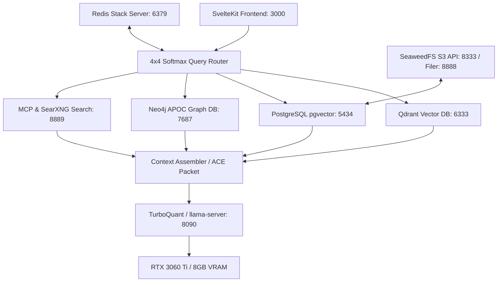

# DEEDS SYSTEM OPERATIONAL MANUAL: DEPLOYMENT & STATE SECURITY
> **YoRHa Security Clearance Required. Target Environment: Local GPU-Accelerated Workstation.**
> *Ref: Phase 17 — Production Packaging & State Resilience Protocols*
>
> This is a runtime/deployment guide, not the planning roadmap. For feature
> work, use the split decision docs and the corrected operator order:
> BM25 + concept activation -> deeds/engram optional adapter ->
> XGBoost formal reranker -> Neo4j contextual trees + HyperRAG packet RPC ->
> Autoencoder / SOM latent topology -> native GEMM deferred.
>
> Decision docs:
> - `docs/atlas/parent-atlas-storage-decision.md`
> - `docs/atlas/xgboost-reranker-contract.md`
> - `docs/atlas/native-gemm-deferral.md`

---

## 1. Architectural Overview

The **Deeds Workstation Parent Atlas** represents a hybrid execution topology consisting of a containerized data services mesh, a native GPU-accelerated LLM inference server, and a high-performance reactive SvelteKit Svelte 5 frontend client.



---

## 2. Environment Initialization

To configure the production environment, copy the template production config into your local environment:

```bash
cp .env.example.production .env.production
```

### Critical Environment Matrix
| Service | Environment Key | Host Port | Target Port | Role |
| :--- | :--- | :--- | :--- | :--- |
| **PostgreSQL** | `DATABASE_URL` | `5434` | `5432` | Relational Storage + pgvector (Cosine) |
| **Redis Stack** | `REDIS_URL` | `6379` | `6379` | BitFrost Hot Memory, Ace Packets, SOM Clusters |
| **Qdrant** | `QDRANT_URL` | `6333` | `6333` | Dense High-Dimensional Vector Search (768/384) |
| **Neo4j** | `NEO4J_URI` | `7687` | `7687` | Knowledge Graph apoc / Graph Data Science |
| **SeaweedFS Filer**| `SEAWEED_ENDPOINT` | `8888` | `8888` | Primary S3 gateway metadata filer |
| **SeaweedFS S3** | `MINIO_ENDPOINT` *(legacy alias)* | `8333` | `8333` | High-throughput asset S3 endpoint |
| **SearXNG** | `SEARXNG_PORT` | `8889` | `8080` | Privacy-respecting web metasearch scraping |
| **TurboQuant** | `TURBO_PORT` | `8090` | `8090` | Native llama-server CPU/GPU offload engine |

---

## 3. Single-Command Orchestration Start

Start all containerized databases, indexers, and brokers with a single production command:

```bash
docker compose -f docker-compose.production.yml up -d
```

> [!IMPORTANT]
> Always verify that local non-containerized services are stopped before launching Docker Compose (e.g., stop native `postgresql` services on host port 5432 to prevent conflict with mapped container port 5434).

---

## 4. Operator Preflight Sentinel Checks

Before launching the SvelteKit frontend server or scheduling background RAG tasks, execute the preflight check script to verify all TCP sockets and application REST endpoints:

```bash
node scripts/operator/preflight.mjs --strict
```

### Script Behaviors:
- **TCP Scans**: Probes connection handshakes for `Postgres`, `Redis`, and `Neo4j`.
- **HTTP / REST Scans**: Performs application-layer queries to `Qdrant` (`/readyz`), `SearXNG` (`/`), `SeaweedFS` (`/`), and `TurboQuant` (`/health`).
- **Strict Mode**: Automatically exits with exit code `1` if any required service (Postgres, Redis, Qdrant, SeaweedFS, TurboQuant) returns offline.

---

## 5. Hot State Security: Backups & Restoration

The state of the Parent Atlas is divided across relational tables, dense vector spaces, semantic graph topologies, and hot caching tables. A failure in any layer degrades routing and synthesis.

### 5.1 Hot State Backup

Execute the hot backup script while the database services are actively running:

```bash
node scripts/operator/backup-atlas-state.mjs
```

**Actions Executed:**
1. **PostgreSQL**: Performs an inline dump of the schema and table rows using the container's built-in `pg_dump` binary to avoid driver mismatches.
2. **Redis**: Forces a memory dump (`SAVE` command) and pulls `dump.rdb` directly from the container's persistent storage.
3. **Qdrant**: Contacts the vector API, queries active collections, triggers REST collection snapshots, copies `.snapshot` files out, and cleans up intermediate artifacts inside the container.
4. **Neo4j**: Exports nodes, properties, and relationships to Cypher statements using native APOC Cypher export queries (`apoc.export.cypher.all`).

All output files are cataloged under a new timestamped folder: `backups/atlas-YYYY-MM-DDTHH-mm-ss-msZ/`.

### 5.2 Hot State Restoration

To restore your entire local Workstation Parent Atlas workspace to the latest consistent snapshot (or a specific historical directory), execute the restore script:

```bash
# Auto-detects and restores the latest snapshot in backups/
node scripts/operator/restore-atlas-state.mjs

# Restores a specific snapshot folder
node scripts/operator/restore-atlas-state.mjs backups/atlas-2026-05-17T17-30-00-000Z
```

**Actions Executed:**
1. **PostgreSQL**: Wipes existing conflicting schemas and imports the complete SQL dump.
2. **Redis**: Injects the backup `dump.rdb` and performs a clean container hot-restart to reload memory.
3. **Qdrant**: Resolves active collections, handles dynamic creation of missing vector indices (dimensions 768/384), maps the `.snapshot` binaries, and calls the local `file:///` snapshot recovery REST API.
4. **Neo4j**: Executes the entire Cypher knowledge graph script to rebuild the Neo4j schema and data from scratch.

---

## 6. TurboQuant LLM Engine Management

TurboQuant runs on the host system to utilize raw GPU and Vulkan device resources without container abstraction overhead.

### 6.1 Launch Protocols

To launch the TurboQuant server detached (in the background):

```bash
npm run turbo:start:detached
```

To view the current server health:

```bash
npm run turbo:status
```

### 6.2 RTX 3060 Ti (8GB VRAM) Hygiene Policies
- **VRAM Eviction Pre-flight**: The launcher automatically polls the native Ollama API (`11434/api/ps`) and issues an eviction command (`keep_alive: 0`) to free up space. This prevents GPU allocation conflicts before loading the Gemma 4 GGUF model into VRAM.
- **Asymmetric KV Quantization**: Configures `-ctk q8_0` (Key Cache) and `-ctv q8_0` (Value Cache) symmetric quantization for robust, quality-preserving token throughput.
- **Cache Prefix Reuse**: Enables `--cache-prompt` and `--cache-reuse 256` to drastically minimize GPU prefill processing times on repetitive legal system instructions.

---

## 7. Operational Audit Verification

Verify the health, performance, and contract alignment of the stack using the built-in validator suite:

```bash
# Layer 1: Run comprehensive cross-layer contract audit
npm run audit:contracts

# Layer 2: Check pgvector extension, HNSW indexes, and dimensions
npm run audit:pgvector

# Layer 3: Perform 10 cycles of the Workstation Parent Atlas soak test
npm run soak:dry
```

---
> **End of Operational Document. Maintain System Hygiene.**
