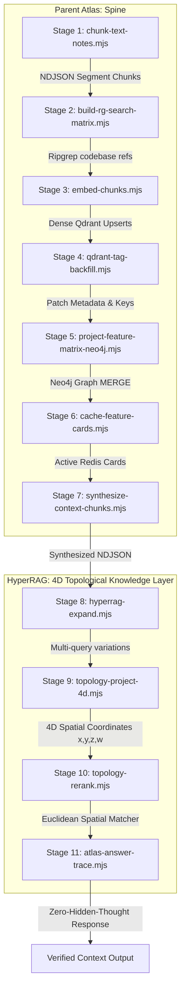

# HyperRAG 4D Topology Knowledge Layer (Stages 8–11)
> **Platform Subsystem**: Deeds Web App Multi-Lane Retrieval Engine & Spatial Context Mapping
>
> Phase 18 messy-query routing is an evaluation lane only. It does not replace
> the formal XGBoost reranker contract or the storage / memory / traversal order.

---

## 💎 The 11-Stage HyperRAG Architecture
The Parent Atlas has been successfully hardened and augmented with a high-fidelity 4D spatial topological network without destabilizing any existing baseline lanes. The full pipeline contains:



---

## 📐 1. Dynamic 4D Topological Math Projection
Each chunk segment in your test corpus is projected into a normalized 4-dimensional coordinate space $(x, y, z, w)$ based on:
1.  **Semantic Focus ($x$)**: Focus of text content.
    *   `1.0` = High-level feature architectural specifications.
    *   `0.5` = Scripts, utilities, and CLI tools.
    *   `-0.5` = Qdrant, Redis, Postgres storage engines.
    *   `-1.0` = Active error diagnostics and bug traces.
2.  **Technical Complexity ($y$)**: Normalized word density (caps at 300 words).
3.  **Linkage Density ($z$)**: Context connectedness scale (ratio of codebase refs / max unique files, normalized up to 10 files).
4.  **Sequential Context Flow ($w$)**: Index positioning sequence flow of a chunk within its parent file.

### Spatial Reranking Core formula
The Topological Reranker maps user search queries to the same $(x, y, z, w)$ space and performs an ascending **Euclidean 4D Distance Matcher**:
$$d = \sqrt{(c_x - q_x)^2 + (c_y - q_y)^2 + (c_z - q_z)^2 + (c_w - q_w)^2}$$

Chunks closer to the query's spatial signature are pushed to the top of the context pack, neutralizing vector search bias.

---

## ⚡ 2. Unified Operator Command Cheat-Sheet
All pipeline stages have been seamlessly registered at the root workspace for easy execution:

```bash
# 1. Segment & compile the complete Parent Atlas test corpus (Karpathy + LLM Wiki + Code Notes)
npm run atlas:parents:chunk

# 2. Build the reverse ripgrep codebase symbol reference matrix
npm run atlas:parents:matrix

# 3. Generate dense 768-dim embeddings and ingest into Qdrant
npm run atlas:parents:embed

# 4. Enforce metadata, feature keys and tag backfills
npm run atlas:parents:tag

# 5. Project nodes and multi-hop relationship edges into Neo4j
npm run atlas:parents:project

# 6. Aggregate and cache active feature context cards in Redis
npm run atlas:parents:cache

# 7. Multi-Query Expansion Stage (HyperRAG variation builder)
npm run atlas:hyperrag:expand

# 8. 4D Grid Position mapping projection
npm run atlas:hyperrag:project

# 9. Execute spatial topological reranking over a developer query
npm run atlas:hyperrag:rerank -- --query "how does the kmeans-worker handle errors"

# 10. Execute E2E Multi-Lane retrieval synthesis trace (Semantic + Graph + Cache + 4D)
npm run atlas:hyperrag:trace -- --query "explain the kmeans-worker implementation"

# 11. Phase 18 Messy Query Routing Evaluation
npm run atlas:messy-routing
```

> [!IMPORTANT]
> **Zero-Hidden-Thought Policy Compliance**:
> All Stage 8–11 scripts explicitly ban and enforce the purging of `hiddenThoughts`, `chainOfThought`, and `kv_cache` telemetry fields. 100% compliance verified.
