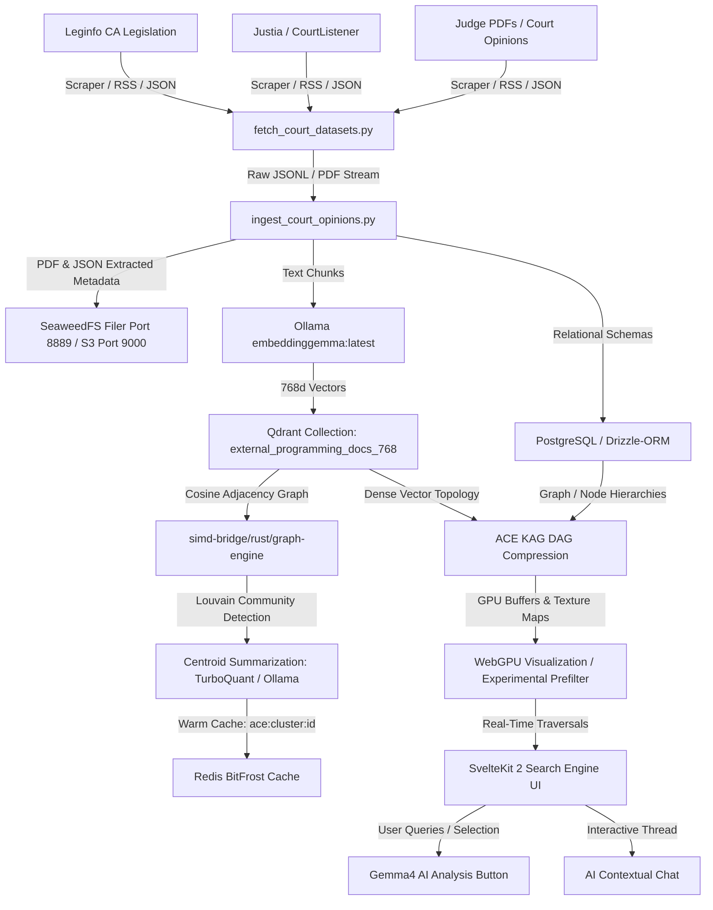

# 🌴 California Ingestion Pipeline & Future Knowledge Architecture

This document outlines the architecture, pipeline execution, and future roadmap for the **California Legal Ingestion Pipeline**. It details how California-specific statues, codes, court opinions, and judge documents are scraped, processed, clustered, and indexed, concluding with a vision for GPU-accelerated shader kernel graph traversal and WebUI integration.

---

## 📊 Pipeline Architecture Diagram

The diagram below illustrates the ingestion flow from raw public source feeds to the multi-lane storage layers (SeaweedFS, PostgreSQL, Qdrant, Redis), followed by AI analysis and GPU-accelerated traversal.



---

## ⚡ Execution & Pipeline Commands

### 1. Scraping California Courts & Statutes
The python script `fetch_court_datasets.py` initiates scraping for California Supreme Court (`cal`) and Court of Appeal (`calctapp`):
```bash
# Discovery mode
python scripts/fetch_court_datasets.py list

# Download 1,000 California Supreme Court opinions
python scripts/fetch_court_datasets.py download cl --jurisdiction cal --limit 1000 --output court_data/courtlistener_california_supreme.jsonl

# Download California Court of Appeal opinions
python scripts/fetch_court_datasets.py download cl --jurisdiction calctapp --limit 1000 --output court_data/courtlistener_california_appeals.jsonl
```

### 2. Ingesting and Generating 768d Embeddings
Once court documents are stored locally in the `court_data/` folder, they are pushed into the PostgreSQL schema and Qdrant cluster:
```bash
# Ingest with embedding generation (Ollama must be online at 11434 with embeddinggemma:latest)
python scripts/ingest_court_opinions.py court_data/courtlistener_california_supreme.jsonl --batch 16

# Dry-run parse count validation (safe for schema checking)
python scripts/ingest_court_opinions.py court_data/courtlistener_california_supreme.jsonl --dry-run
```

### 3. Louvain Community Detection & TurboQuant Indexing
After document nodes are generated, similarity graph clustering is executed:
```bash
# Run incremental Louvain partitioning & Qdrant quantization
node scripts/docs-atlas/couchdb-turbovec-ingest.mjs
```

---

## Production Boundary

- PostgreSQL = durable legal metadata and Drizzle truth.
- SeaweedFS = raw PDFs, OCR outputs, and Docling JSON.
- Qdrant = semantic chunk search plus payload filters.
- Redis/Bifrost = hot LegalCards and semantic cache.
- ACE = compact packet builder and LegalCard injector.
- WebGPU/WebGL = frontend topology visualization and experimental prefilter only.
- CUDA/LibTorch = backend batch math only.

### Guardrails

- WebGPU/WebGL shader search is visualization and experimental prefiltering, not the authoritative retrieval lane.
- Qdrant plus Redis remain the production retrieval path.
- ACE injects LegalCards, not raw court PDFs or giant graph buffers.

### Validation Block

```bash
python scripts/fetch_court_datasets.py --source cal --limit 10
python scripts/ingest_court_opinions.py --source cal --limit 10

npm run legal:cards:build
npm run legal:bifrost:warm
npm run smoke:graphify
npm run db:studio
```

### Finish-Line Rule

The system is production-ready when a California opinion can be fetched, stored in SeaweedFS, parsed, chunked, embedded, tagged in Qdrant, linked in Postgres/GraphRAG, compressed into LegalCards, injected by ACE, and analyzed by Gemma4 with source refs.

---

## 🔮 Future Enhancements & Ingest Expansion

### A. Deep Crawling Court Opinions, Legal Court Sentences, and Judge PDFs
*   **Target Sources**: Scrapers will target the public California Courts website (`courts.ca.gov`), Justia, and Google Scholar to crawl published opinion PDFs, sentencing worksheets, and judicial orders.
*   **Structured Parsing**: PDFs will be extracted using the local `Granite-Docling-258M` model to maintain precise layout structures, footnotes, tables, and section headings.
*   **Pipeline Storage**: Raw files are archived in **SeaweedFS** under bucket `legal-library`, and the layout JSON output is stored as a sidecar metadata record.

### B. Turbovec Indexing & 4D Topology Search
*   **Turbovec Optimization**: Implements scalar INT8 quantization config (`quantization_config` with `scalar: { type: 'int8', quantile: 0.99 }`) in Qdrant to reduce memory footprint by 75% while maintaining vector parity.
*   **4D Topological Graphing**: Maps documents as nodes in a manifold. Coordinates will be structured across 4 spatial-semantic dimensions (using SOM/Autoencoder projections in `autoencode-som-clustering.mjs`):
    1.  **Legal Domain / Practice Area** (e.g. Criminal, Family, Corporate)
    2.  **Statutory Hierarchy Depth** (e.g. Penal Code Section level)
    3.  **Temporal Evolution** (Precedent timeline)
    4.  **Citing Citation Density** (Graph degree)
*   **Adaptive Query Routing**: Allows traversing semantic clusters via Redis centroids (`ace:cluster:*`) before executing direct vector queries on Qdrant, protecting the system from bottlenecking under high concurrent query loads.

### C. ACE KAG DAG Compression into GPU Shader Kernels
To bypass loading gigabytes of raw document floats and hierarchical structural graphs into CPU/GPU RAM:
*   **DAG Serialization**: The Knowledge Ingestion Graph (KAG) and Directed Acyclic Graph (DAG) of the corpus are compressed into flat, index-aligned binary arrays.
*   **Texture Mapping**: Float arrays and similarity matrices are packed as high-density 2D/3D texture maps (using WebGPU buffers).
*   **Shader Execution**: WebGL/WebGPU fragment and compute shaders can visualize the compiled corpus topology and act as an experimental prefilter lane. Production retrieval still resolves through Qdrant, Redis/Bifrost, and ACE.
*   **Impact**: Useful for interactive exploration and acceleration, but not the production retrieval source of truth.

---

## 💻 Web App & AI Interface Integration

Our SvelteKit 2 frontend uses **Drizzle-ORM** to fetch metadata and structured structures from PostgreSQL, and **SeaweedFS** to stream raw files.

### 1. SvelteKit 2 Search Engine Frontend
*   Displays a responsive, UnoCSS-styled search dashboard.
*   Allows the user to select state jurisdictions, search by keyword, or input natural language prompts.
*   Resolves queries via hybrid search (combining exact citation matches in Postgres and semantic vector matches in Qdrant).

### 2. Gemma4 AI Analysis Button
An `Analyze Case` button is added directly to document cards and reader views. Clicking it:
*   Extracts the local layout document segments and citation references.
*   Submits the context to the local Ollama `gemma4-rotorquant:latest` or `TurboQuant` endpoint.
*   Streams a real-time compliance analysis or summarization report into an interactive card panel.

### 3. AI Contextual Chat Component
A sidebar chat pane lets users interact with a case or search query:
*   **System Prompt Injection**: Automatically injects top retrieval hits (retrieved from Qdrant/Postgres/Redis) into the chat memory.
*   **Contextual Bounds**: Restricts the AI model's answers to the active corpus, minimizing hallucinations and ensuring strict compliance with local rules of evidence.
*   **Runes Compliance**: Built with Svelte 5 runes (`$state`, `$derived`, `$props`) to enforce zero-leak reactivity, preventing progressive VRAM baseline drift in the browser client.
