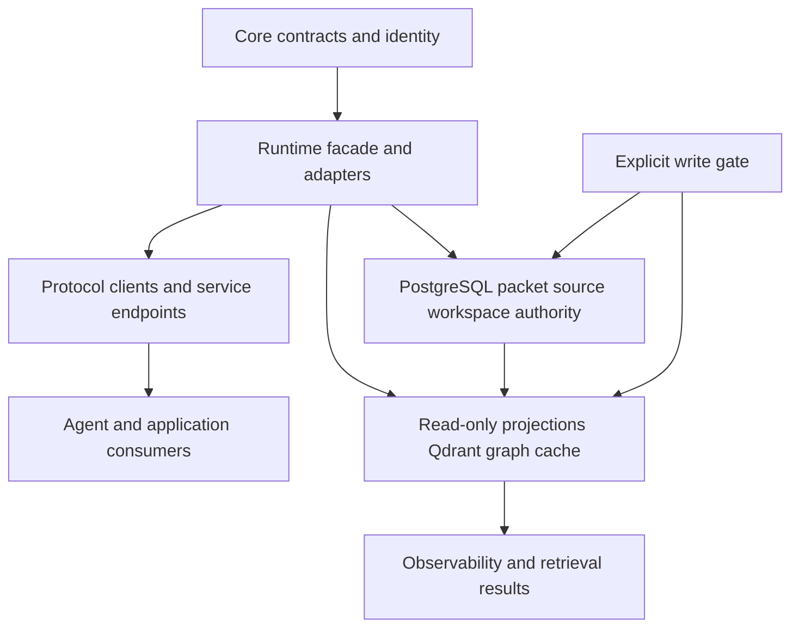
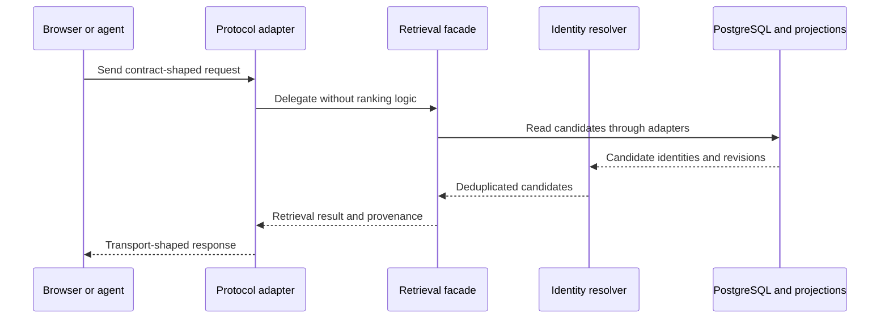
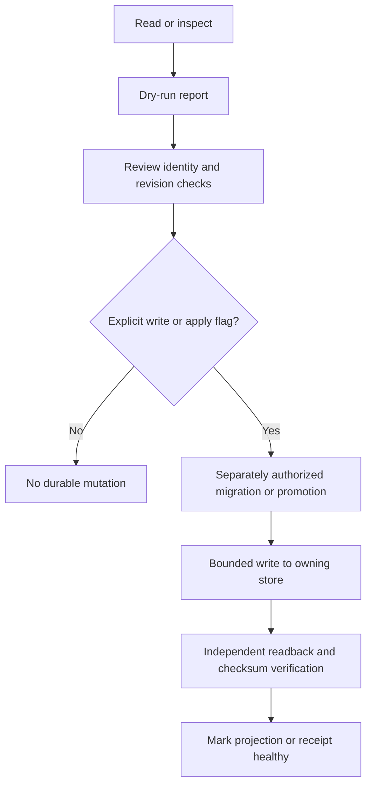

# Ownership, Authority, and Write Boundaries

Parent Atlas has one architectural rule that prevents most dangerous integrations: **contracts describe behavior, runtime adapters implement it, protocol clients transport it, projections accelerate or observe it, and durable stores own state**. A protocol adapter is not a second retrieval engine, and a vector or graph projection is not a second identity authority.

This page is the change-planning boundary map. It is intentionally conservative: a behavior marked **proven** is supported by repository evidence; **proposed** is a design direction rather than an available guarantee; **blocked** is explicitly excluded or gated; **unknown** requires a live-schema or implementation decision before it can be treated as a contract.

## Boundary map

This diagram shows the intended dependency direction and the separation between canonical PostgreSQL state, rebuildable projections, and gated mutation.

### Proven dependency boundaries

- **Core contracts** are the infrastructure-free boundary. They define retrieval requests and results, policies, packet identity, context, and provenance; they must not import HTTP, gRPC, MCP, A2A, SvelteKit, or Vercel AI SDK code.
- **Runtime** owns infrastructure-backed retrieval: database and service adapters, identity resolution, fusion, and the retrieval facade. It may use Postgres, Qdrant, and Neo4j through adapter functions, but it does not contain protocol handling.
- **Protocol clients** own transport concerns, transport errors, retries, and timeouts. They may import contracts, but must not import runtime implementation or perform ranking, deduplication, or graph traversal.
- **Agent wrappers** translate tools and authorization policy. They consume clients and contracts; they must reach runtime through a client boundary rather than calling runtime directly.
- **Service endpoints** are thin orchestration boundaries: HTTP, gRPC, and MCP entrypoints delegate to the facade and add authorization and telemetry rather than reimplementing retrieval logic.

The dependency direction is one-way: core → runtime → transport-facing consumers, with the client depending on core but not runtime. This keeps replacing REST, gRPC, MCP, or A2A from changing retrieval semantics.

## Authority and ownership

### PostgreSQL is canonical

PostgreSQL owns durable packet identity, packet/source/workspace revisions, and provenance. `atlas_packets` and the existing workspace/source revision owners are reused rather than replaced by a registry or projection table. A packet registry may index projection metadata, but its packet foreign key and revisions must resolve back to PostgreSQL truth.

The data-spine design gives the same split explicit names:

- cold originals are immutable files or archives;
- warm packets/cards are compact indexes pointing back to cold originals;
- hot cache is active task memory and recent retrieval state;
- queues are pending work, not source truth;
- Qdrant is semantic lookup, not identity authority;
- Neo4j supplies graph-path evidence, not packet ownership;
- `.okf`, MsgPack, Arrow IPC, Redis/BitFrost, and embedding lanes are contract, codec, batch, cache, or lookup lanes—not canonical identity stores.

`packages/atlas/lib/packet-registry.mjs` reinforces this at the mutation boundary. Canonical `title_id` generation is centralized, identity columns (`packet_key`, `source_ref`, `feature_id`, `tree_node_id`, and `qdrant_point_id`) are read-only to title backfills, and only the declared title fields plus `updated_at` are writable for that operation.

### Projections are rebuildable and qualified

A projection can be healthy only when its identity, source revision, model, index, collection, tag, and checksum revisions can be read back and checked against PostgreSQL. The RPC registry design calls for distinct logical lanes for BM25, pgvector, Qdrant dense/sparse, IVFFlat, HNSW, cuVS/RAPIDS, and FastAPI. Mirrors must not create additional retrieval votes merely because the same packet appears in multiple physical stores; SearchRuntime performs normalization and deduplication before fusion.

The semantic-AST RPC is read-only. It carries caller-owned workspace and packet revisions, source references, exact AST spans, parser/grammar revisions, and receipts. Carrying a qualified packet over RPC does not make the transport or executor its owner.

## Runtime and request flow

The sequence shows the proven control-flow boundary: transport enters through a contract, runtime reads through adapters, identity resolution happens before reciprocal-rank fusion, and the result returns through the same transport. If Qdrant is unavailable, the documented fallback is BM25-only; graph expansion may be skipped while core candidates continue. A transport failure is a transport error with retry/escalation semantics, whereas a domain tool failure is passed to the agent rather than silently treated as a network failure.

### The ordering invariant

Candidate sources must be resolved to canonical identity **before** RRF. `BM25 → Qdrant → identity resolution → RRF` is valid; fusing first allows the same packet to rank twice. This is a runtime invariant, not a protocol feature, and therefore belongs in the runtime facade/adapters rather than HTTP, gRPC, MCP, or A2A handlers.

## Mutation gates and lifecycle

This lifecycle describes the required gate for changes to durable state. Dry-run is the default for the data-spine export, normalization, audit, and training-row workflow; external database or vector writes require an explicit `--write`. The registry change similarly excludes automatic migrations, backfills, Qdrant writes, cache warming, promotion, and direct Mastra/LangGraph durable writes. Any production mutation belongs to a later, separately authorized migration or promotion change.

**Do not perform datastore writes or service operations as part of wiki research.** For implementation work, first produce a read-only report, validate canonical IDs and revision checks, and only then use the project-specific explicit apply/write gate under separate authorization. A successful dry-run is evidence for review, not permission to mutate.

## Boundary status

### Proven

- Core/runtime/client layering and the prohibition on protocol logic in runtime are documented as hard rules.
- PostgreSQL packet/source/workspace identity and provenance are canonical; Qdrant, Neo4j, caches, queues, and file/export lanes are not canonical identity stores.
- Identity resolution precedes RRF, and documented fallback behavior preserves a read-only retrieval path when optional infrastructure is unavailable.
- Packet-registry constants protect identity columns from title-backfill updates and centralize the title generator version.
- Drizzle sidecar classification distinguishes journaled migrations, documented sidecars, and undocumented SQL. A documented sidecar is intentionally outside the journal; undocumented numbered SQL is a stale migration requiring resolution rather than silent execution.

### Proposed

- A revision-qualified registry relation may index projection metadata while retaining a PostgreSQL packet foreign key and revision linkage.
- Additive RPC messages, generated bindings, health/readback receipts, and a read-only Studio may expose lane capability and parity information.
- FastAPI may remain an optional GPU executor behind a Go adapter; `dev:gpu` may show capabilities while remaining valid in Engram-only mode.
- Future Arrow/mmap, XGBoost/PyTorch, RL, DAG, HyperGraphRAG, and agentic-search consumers may consume revisioned snapshots and emit receipts, but cannot create canonical identity.

### Blocked or explicitly disallowed

- No new canonical packet store or dual embedding authority.
- No direct Mastra or LangGraph writes to durable stores.
- No protocol client importing runtime implementation or implementing ranking, deduplication, or graph traversal.
- No protocol handler implementing retrieval ranking.
- No projection being marked authoritative merely because it contains a packet; health requires independent PostgreSQL readback and checksums.
- No automatic migration, packet backfill, Qdrant write, cache warming, model training, or promotion from the registry change.
- No QUIC coupling to runtime code or rewriting Postgres/Qdrant/gRPC as QUIC APIs; QUIC terminates at the edge proxy.

### Unknown and must remain unresolved

- Whether registry projection rows belong in a new additive table or an existing packet metadata/manifest relation; this requires a live schema audit.
- Which existing producer is authorized to emit the first canonical AST packet cohort.
- Whether the FastAPI GPU lane should expose gRPC directly or remain HTTP behind a Go adapter.
- Whether a sidecar SQL file has actually been applied: classification documents intent but does not prove database state. Verify through a read-only audit before any separately authorized apply.
- The actual live counts and health of PostgreSQL packets, projection rows, and vector points; repository documentation warns that historical counts become stale and must be re-queried.

## Safe extension checklist

1. Add or revise a contract first; keep it JSON/protobuf serializable and free of infrastructure imports.
2. Put database, vector, graph, and identity work behind runtime adapters.
3. Add a protocol adapter that delegates to the facade; do not duplicate business logic.
4. Carry workspace, packet, source, parser, model, and index revisions through the boundary.
5. Deduplicate by canonical identity before fusion and preserve provenance in the result.
6. Make inspection and dry-run the default. Separate report generation from mutation.
7. Require an explicit write/apply gate, authorization, and independent readback before declaring a projection healthy.
8. Treat missing optional executors as unavailable capabilities, not as permission to invent a second authority.

## Focused verification

The `drizzle-sidecar-policy.spec.ts` test is valuable because it verifies the migration boundary rather than merely a helper’s existence: documented sidecars are classified as informational and intentional, while an unjournaled and undocumented SQL file is classified as a medium-severity stale migration. Packet-registry consumers should likewise test that canonical title IDs use the shared version and that forbidden identity columns cannot enter an update set. Registry/RPC work should use fixture, replay, identity, parity, and readback tests before rollout; those tests are proposed verification gates, not evidence that the unimplemented registry exists today.

## Evidence map

- System layering and transport separation: `docs/PARENT-ATLAS-SYSTEM-BOUNDARIES.md`
- Storage authority, deterministic IDs, dry-run/write gates, and store responsibilities: `docs/atlas/parent-atlas-data-spine.md`
- Revision-qualified registry decisions and explicit non-goals: `openspec/changes/parent-atlas-rpc-packet-registry-fabric/design.md`
- Identity and title-backfill mutation constraints: `packages/atlas/lib/packet-registry.mjs`
- Migration sidecar classification and focused test: `scripts/atlas/drizzle-sidecar-policy.mjs` and `sveltekit-frontend/src/lib/server/atlas/drizzle-sidecar-policy.spec.ts`
