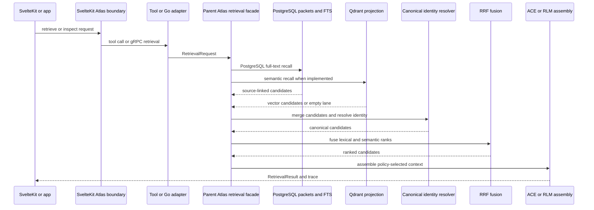

# System Map and Runtime Domains

## Reading this map

This page describes two overlapping shapes:

- **Implemented:** the current TypeScript packages and SvelteKit server Atlas exports, including the PostgreSQL full-text query, identity resolution, RRF fusion, policy-driven facade, and tool/Go-client adapters.
- **Design intent:** the broader boundary contract for a standalone Parent Atlas service, Qdrant semantic recall, Neo4j expansion, learned reranking, protocol servers, and asynchronous A2A delegation. Those surfaces are not treated as live merely because the architecture document names them.

The governing data rule is that PostgreSQL `atlas_packets` and source/workspace records own packet identity and status. Qdrant points, graph nodes, Redis or Bifrost cache entries, RPC responses, and agent contexts are projections or adapters; they must preserve the canonical identity rather than become an alternate authority. The core package makes this explicit with `canonical_store: 'postgres'` and mirrors for `qdrant`, `neo4j`, `redis`, and `couchdb` ([core identity contract](../../packages/parent-atlas-core/src/index.ts#L18-L34)).

## Runtime and domain flow

*Caption: Implemented facade control flow, with the vector, graph, and learned-ranking calls marked by their current implementation status in the text below.*

## Runtime domains

### 1. SvelteKit application boundary — **implemented, integration surface**

`src/lib/server/atlas/atlas-index.ts` is a unified server-side export boundary. It exposes Atlas runtime context and state-machine policy, registry recommendations, the Mastra tool adapter, the Go retrieval client (`retrieveFromGo`, `buildContextFromGo`, and `validatePacketFromGo`), packet processing/consumer functions, ranking feature construction, phase-lane proofs, and Kanban task operations ([Atlas index](../../sveltekit-frontend/src/lib/server/atlas/atlas-index.ts#L1-L76), [task exports](../../sveltekit-frontend/src/lib/server/atlas/atlas-index.ts#L86-L124)). This is an application-facing orchestration boundary, not the owner of packet identity or retrieval storage.

The SvelteKit layer may coordinate requests, tools, boards, and runtime observations. It should call a transport or domain facade rather than reimplement ranking or mutate canonical identity. The boundary contract’s planned deployment shape puts HTTP/REST at the application edge and keeps protocol handling outside the retrieval core; the exact standalone `parent-atlas-service` routes remain **design intent** ([boundary contract](../../docs/PARENT-ATLAS-SYSTEM-BOUNDARIES.md#L150-L174)).

### 2. Parent Atlas core — **implemented contract package**

`@deeds/parent-atlas-core` is the dependency-light contract and policy layer. It exports `RetrievalFacade`, request/result types, retrieval policies, ranked candidates, context types, provenance, the identity chain, and lineage verification. Its identity chain runs from directory and source reference through symbol and feature classification to `packet_key`; verification rejects missing identity fields ([core exports](../../packages/parent-atlas-core/src/index.ts#L14-L34), [lineage verification](../../packages/parent-atlas-core/src/index.ts#L46-L79)).

The package is intended to remain infrastructure- and protocol-neutral. Its package metadata currently includes `zod` and `drizzle-orm`, so “zero runtime dependencies” should be read as an architectural boundary rule, not as a claim that the published package has no declared dependencies ([package metadata](../../packages/parent-atlas-core/package.json#L30-L41)).

### 3. Retrieval runtime — **partially implemented**

`@deeds/parent-atlas-runtime` owns infrastructure-backed adapters and the `ParentAtlasRetrievalFacade`. The facade obtains a use-case policy, runs PostgreSQL lexical recall, prepares the Qdrant lane, resolves identity **before** RRF, fuses candidates, applies graph/rerank/validation limits, assembles ACE or RLM context, and returns a stage trace ([facade](../../packages/parent-atlas-runtime/src/facade/retrieval-facade.ts#L52-L63), [pipeline](../../packages/parent-atlas-runtime/src/facade/retrieval-facade.ts#L67-L193)). This ordering is a safety invariant: deduplication must precede fusion so one packet is not ranked twice.

The live first recall lane is PostgreSQL native full-text search, not true BM25. `searchPostgresFts` queries the GIN-backed `codebase_chunk_index.search_vector` with `websearch_to_tsquery` and `ts_rank_cd`, then joins to `atlas_packets` by exact `(source_ref, content_hash)` or by an admitted `EXACT_CANONICAL_ID` identity link ([FTS adapter](../../packages/parent-atlas-runtime/src/adapters/postgres-fts.adapter.ts#L4-L17), [query and identity lanes](../../packages/parent-atlas-runtime/src/adapters/postgres-fts.adapter.ts#L118-L209)). The old `postgres-bm25.adapter.ts` is a compatibility re-export and is explicitly deprecated ([compatibility adapter](../../packages/parent-atlas-runtime/src/adapters/postgres-bm25.adapter.ts#L1-L9)).

Several facade stages are explicit placeholders today: query embedding and Qdrant search, Neo4j k-hop expansion, XGBoost/CrossEncoder reranking, and health probes for backing services. The code still records these stages and continues with bounded candidates, but documentation must label them **planned or placeholder**, not production behavior ([facade TODO stages](../../packages/parent-atlas-runtime/src/facade/retrieval-facade.ts#L85-L93), [graph/rerank placeholders](../../packages/parent-atlas-runtime/src/facade/retrieval-facade.ts#L122-L143), [health placeholder](../../packages/parent-atlas-runtime/src/facade/retrieval-facade.ts#L202-L211)).

### 4. Client and protocol adapters — **package implemented; protocol coverage mixed**

`@deeds/parent-atlas-client` is packaged as a transport-client layer for HTTP/REST, gRPC, MCP, and A2A, and depends on core plus gRPC libraries ([client package](../../packages/parent-atlas-client/package.json#L1-L30)). Its architectural responsibility is serialization, transport errors, retries, timeouts, and protocol-specific lifecycle—not deduplication, ranking, graph traversal, or packet writes. The boundary document describes gRPC and A2A implementations as **TODO/design intent** in the target service shape, so callers should verify the concrete client before selecting a transport ([protocol boundary](../../docs/PARENT-ATLAS-SYSTEM-BOUNDARIES.md#L92-L117), [planned service](../../docs/PARENT-ATLAS-SYSTEM-BOUNDARIES.md#L150-L173)).

### 5. Atlas orchestrator and optional compute/agent adapters — **implemented package, optional lanes**

`@deeds/atlas-orchestrator` packages Mastra workflows, LangGraph, checkpoints, PostgreSQL/Redis stores, LangSmith, and model-facing dependencies. Its exports include workflows, steps, executors, models, and a prompt-plan agent; its scripts distinguish build, test, lint, type-check, development, and runtime import smoke checks ([orchestrator metadata](../../packages/atlas-orchestrator/package.json#L1-L25)). This domain is for durable operations such as PageRank, clustering, registry alignment, labeling, planning, and agent workflows—not canonical packet ownership.

The SvelteKit Atlas boundary also exposes Mastra tools and a Go retrieval gRPC client. These are adapters: they can request retrieval, validation, context, delegation, or runtime inspection, but they must not bypass the core identity contract or call storage as an authority. MCP is a tool protocol and A2A is an asynchronous task-delegation design; neither changes the canonical packet record ([protocol distinction](../../docs/PARENT-ATLAS-SYSTEM-BOUNDARIES.md#L217-L262)).

## Ingestion and indexing lanes

Ingestion creates or reconciles PostgreSQL packet/source/workspace records and their immutable identity fields. Indexing then projects those records into searchable forms: PostgreSQL `tsvector`/GIN for lexical recall, Qdrant for vectors, graph stores for bounded context, and cache/RPC/agent surfaces for acceleration or integration. The canonical contract forbids enrichment from changing `packet_key`, `source_ref`, `feature_id`, `feature_label`, or identity provenance; enrichment belongs in metadata subtrees such as topology, ranking, graph, and memory ([identity immutability](../../docs/CANONICAL-ARCHITECTURE-CONTRACT.md#L9-L80)).

Operationally, an indexing failure must not be “fixed” by inventing a new packet identity in a projection. Reconcile the source record first, then rebuild the affected projection. Missing or ambiguous chunk-to-packet links are not equivalent to canonical identity: the live FTS adapter admits only `EXACT_CANONICAL_ID` bridge rows and excludes unresolved or ambiguous rows ([identity-link guard](../../packages/parent-atlas-runtime/src/adapters/postgres-fts.adapter.ts#L165-L197)).

## Change and failure invariants

1. **Canonical ownership:** PostgreSQL packet/source/workspace state wins; projections are disposable and rebuildable.
2. **Ordering:** lexical/vector recall → identity resolution → RRF. Never fuse unresolved duplicates ([ordering rule](../../docs/PARENT-ATLAS-SYSTEM-BOUNDARIES.md#L284-L299)).
3. **Boundedness:** source scopes and limits are applied at recall; graph expansion is a bounded optional stage, not an unbounded traversal.
4. **Graceful degradation:** a missing vector lane can leave lexical candidates; failed graph expansion can leave core candidates. Transport retry/escalation belongs to clients, while domain tool failures remain visible to the agent ([fallback policy](../../docs/PARENT-ATLAS-SYSTEM-BOUNDARIES.md#L301-L310)).
5. **Observability:** the facade returns stage durations and candidate counts, making partial or placeholder stages visible in the retrieval trace ([trace construction](../../packages/parent-atlas-runtime/src/facade/retrieval-facade.ts#L168-L193)).

For authority ownership and boundary decisions, see [Boundaries and Authority](boundaries-and-authority.md). For concrete transport adapters, see [Protocol and Service Adapters](../integrations/protocol-and-service-adapters.md). For one request’s lifecycle, see [Retrieval Request](../workflows/retrieval-request.md).
