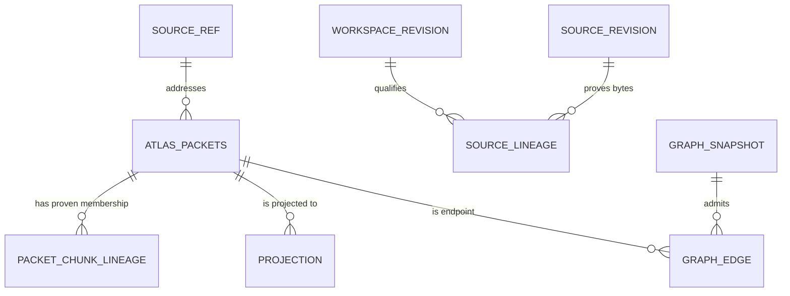
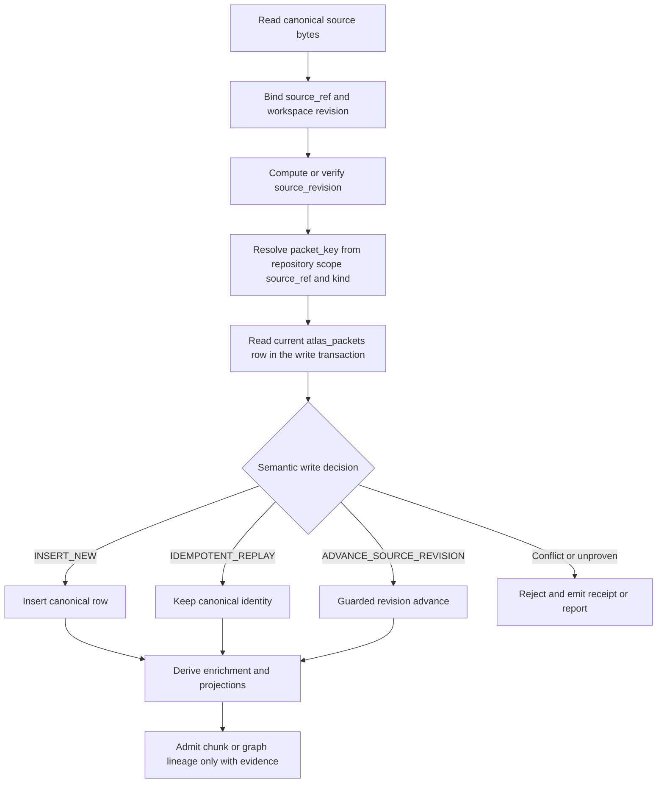

# Packet Identity and Provenance

A **packet** is the file-granularity canonical record addressed by `packet_key`. In the current implementation, PostgreSQL `atlas_packets` is the authoritative packet/source record; Qdrant, graph stores, Redis or Valkey, embeddings, rankings, and other indexes are projections or enrichment. A projection may be useful for retrieval, but it does not mint identity or replace the PostgreSQL row.

> **Important status:** `docs/PACKET-CENTRIC-ARCHITECTURE.md` describes `atlas_packet_registry` as a proposed all-service registry and includes a different, broad schema. That document is not sufficient evidence that the proposed table is current authority. The implementation contracts below make `atlas_packets` the authority and explicitly separate canonical identity from projections. Treat the registry proposal as stale or unknown until a migration proves otherwise.

## The identity vocabulary

- **`source_ref`** identifies the canonical source location, such as a repository-relative POSIX path. It is an upstream-owned value: `workspace-source-binding-v1.ts` validates and stores it, while Packet Key V2 rejects non-canonical spellings rather than normalizing them locally. Case is preserved. This prevents two spellings of one file from silently producing two identities.
- **`repositoryScope`** is the membership repository namespace, obtained from revision-qualified file membership (`graphify_execution_file_membership_v2.repository_id`). It must not be substituted with the per-row `atlas_packets.repository_id` or a directory-like workspace name.
- **`packet_kind`** currently has one defined value, `SOURCE_FILE`. A symbol or graph-node packet requires a separate identity contract, not an invented extension of the file key.
- **`packet_key`** is immutable logical identity. Packet Key V2 computes `packet:${UUIDv5(...)}` from exactly `repositoryScope`, canonical `source_ref`, and `packet_kind`; source revisions, workspace revisions, Qdrant IDs, graph-node keys, ordinals, and `latest`/`current` are forbidden inputs.
- **`source_revision`** is evidence about the exact source bytes, normally `sha256:<64 hex characters>`. It qualifies a packet but does not change its key. A packet revision additionally incorporates the packet key, source reference, source revision, content digest, and packet schema revision; workspace, executor, feature, cache, and timestamp metadata are deliberately excluded.
- **`workspace_revision`** identifies the immutable workspace state in which processing occurred. **`repository_revision`** is a separate compiler/repository lineage axis and is not a content digest. Neither should be collapsed into `source_revision`.
- **Feature and enrichment metadata** (embeddings, labels, summaries, clusters, rerank scores, cache state, and retrieval counters) describe a packet or a representation of it. They are mutable enrichment/projection state, not identity.

Caption: Canonical packets and source lineage remain distinct from chunk membership, graph evidence, and retrieval projections.

## Revision and authority axes

The `atlas.source-lineage-axes.v1` contract intentionally carries `workspaceRevision`, `repositoryRevision`, and exact `sourceContentRevision` separately. It reports `MATCHED`, `MISSING_BINDING`, or `CONFLICT`; it sets `canonicalAuthority: false` because reconciliation is an observation, not authority selection. A missing or conflicting binding must remain visible as such—do not synthesize a digest or silently choose a revision.

The content bridge computes `contentDigest` directly from exact bytes and sets `sourceRevision` to `sha256:${contentDigest}`. Its `readOnlyObservation: true` and `canonicalAuthority: false` flags make clear that a producer observation is evidence for a later guarded write, not a database mutation by itself.

A graph edge is admitted only against one immutable graph snapshot. `GraphRevisionSnapshotV1` pairs the workspace revision and graph revision, records source-revision coverage, and seals the pair with a checksum. The snapshot must be built from the workspace owner and graph-source binding receipt; using current `HEAD` plus a separate graph read is explicitly disallowed. Edge admission fails closed for unresolved or ambiguous endpoints, unbound source/workspace/graph revisions, or absent evidence references. There is no partial promotion.

## Lifecycle and control flow

Caption: Identity is resolved before enrichment, and every write is classified against freshly read PostgreSQL state.

### Guarded writes

`decidePacketWrite()` is a pure decision layer. The caller must read current canonical state inside the same transaction that applies the write; `ON CONFLICT` or row counts must not be used to infer semantics after the fact. The decision order is material:

1. A new row requires both `sourceRevision` and `workspaceRevision`; otherwise it is `REVISION_UNPROVEN`.
2. An existing row whose `sourceRef` differs is an `IDENTITY_CONFLICT` and is never repaired automatically.
3. A missing revision is `REVISION_UNPROVEN`.
4. Matching source revisions are checked for content and workspace conflicts; a compatible repeat is `IDEMPOTENT_REPLAY`.
5. A changed source revision is an `ADVANCE_SOURCE_REVISION` only when the caller supplies proof that its expected current revision still matches the row. A stale read is `SOURCE_REVISION_CONFLICT`.

This makes “same packet, new source bytes” a controlled revision transition rather than an accidental overwrite. It also prevents a producer with no evidence from filling missing revision fields with a plausible placeholder.

## Packet-to-chunk and packet-to-graph lineage

A file packet is not a chunk. A file with 37 chunks remains one `atlas_packets` row plus up to 37 proven membership rows in `atlas_packet_chunk_lineage`; it must not be reduced to one representative chunk. `canonicalChunkId` must come from an existing `codebase_chunk_index.chunk_id` read at write time. It may not be generated from `source_ref`, a random UUID, a tree-node ID, a Qdrant point ID, or nearest-match inference.

Only proven memberships are admitted. Unresolved or ambiguous candidates belong in receipts/reports or a candidate table. Membership identity is `(packet_key, canonical_chunk_id)`; producer revision and evidence references are provenance on that row, not additional identity. `revisionStatus: UNPROVEN` with a null `sourceRevision` is an honest legacy state, not permission to invent one.

Graph endpoints likewise require exactly one packet match and matching graph/source revisions. Evidence references are mandatory for an admissible edge. The possible failures—`ENDPOINT_UNRESOLVED`, `ENDPOINT_AMBIGUOUS`, `SOURCE_REVISION_UNBOUND`, `WORKSPACE_REVISION_UNBOUND`, `GRAPH_REVISION_UNBOUND`, and `EVIDENCE_UNBOUND`—should be preserved in readback receipts so operators can distinguish missing proof from a bad identity.

## Receipts, tests, and safe change procedure

Receipts are evidence of an observation, binding, snapshot, membership, or admission decision; they do not become a second authority. Checksums make structured receipts tamper-evident, while producer revisions identify the writer or backfill run. When evidence is absent, record `MISSING_BINDING`, `UNPROVEN`, or a named admission failure instead of guessing.

Focused contracts worth running before changing indexing or retrieval include:

- `packet-key-v2.spec.ts`, `packet-key-resolution-v2.spec.ts`, and `packet-key-dominant-scheme.spec.ts`: key determinism, rejected forbidden inputs, and legacy alias resolution.
- `workspace-source-binding-v1.spec.ts`, `source-lineage-axes-v1.spec.ts`, and `packet-digest-bridge-v1.spec.ts`: source spelling, separate revision axes, exact-byte digests, and checksum/read-only semantics.
- `packet-write-decision-v1.spec.ts` and `packet-write-transaction-v1.ts`: read-before-write decisions, optimistic concurrency, idempotent replay, and conflict rejection.
- `packet-chunk-membership-v1.spec.ts`: one-to-many membership, canonical chunk ID ownership, proven/unproven revision states, and uniqueness.
- `graph-revision-snapshot-v1.spec.ts`, `packet-incidence-lineage-v1.spec.ts`, and `packet-incidence-endpoint-resolver-v1.spec.ts`: single-snapshot graph admission, endpoint ambiguity, and evidence requirements.
- `repository-provenance-workflow.spec.ts`: end-to-end snapshot, inventory, structural identity, lexical/semantic enrichment, relationships, projections, validation, and incremental reuse reporting.

When changing a field used by indexing or retrieval, use this order: identify whether it is identity, source/revision evidence, mutable enrichment, or projection metadata; confirm its PostgreSQL owner; preserve the old key and add a versioned contract if identity rules change; run the focused identity/write/lineage tests; then rebuild projections from canonical rows. Do not update Qdrant, graph, or cache identifiers first and attempt to reconcile PostgreSQL afterward.

## Evidence boundaries and known conflicts

The older data-spine document proposes SHA-256 IDs based on a normalization routine that lowercases paths and strips prefixes. That rule conflicts with the current Packet Key V2 contract, which requires an already canonical upstream `source_ref`, preserves case, and uses UUIDv5 over repository scope plus source ref plus packet kind. Until an explicit migration establishes otherwise, the older normalization rule is **stale/unknown**, not a rule to reconcile silently.

Likewise, the packet-centric architecture's “every service updates the registry atomically” pattern is a useful target architecture but does not override PostgreSQL `atlas_packets` authority or the guarded write and lineage contracts. External stores should be treated as rebuildable projections unless a current schema and owner contract proves a stronger guarantee.

### Repository anchors

- `sveltekit-frontend/src/lib/server/atlas/identity/packet-key-v2.ts`
- `sveltekit-frontend/src/lib/server/atlas/identity/packet-revision-v1.ts`
- `sveltekit-frontend/src/lib/server/atlas/identity/source-lineage-axes-v1.ts`
- `sveltekit-frontend/src/lib/server/atlas/identity/packet-write-decision-v1.ts`
- `sveltekit-frontend/src/lib/server/atlas/lineage/packet-chunk-membership-v1.ts`
- `sveltekit-frontend/src/lib/server/atlas/lineage/graph-revision-snapshot-v1.ts`
- `sveltekit-frontend/src/lib/server/atlas/repository-provenance-workflow.ts`
- `sveltekit-frontend/src/lib/server/atlas/repository-provenance-workflow.spec.ts`
