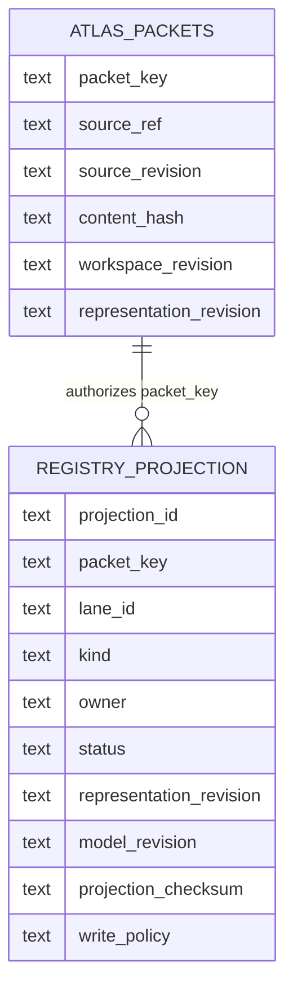
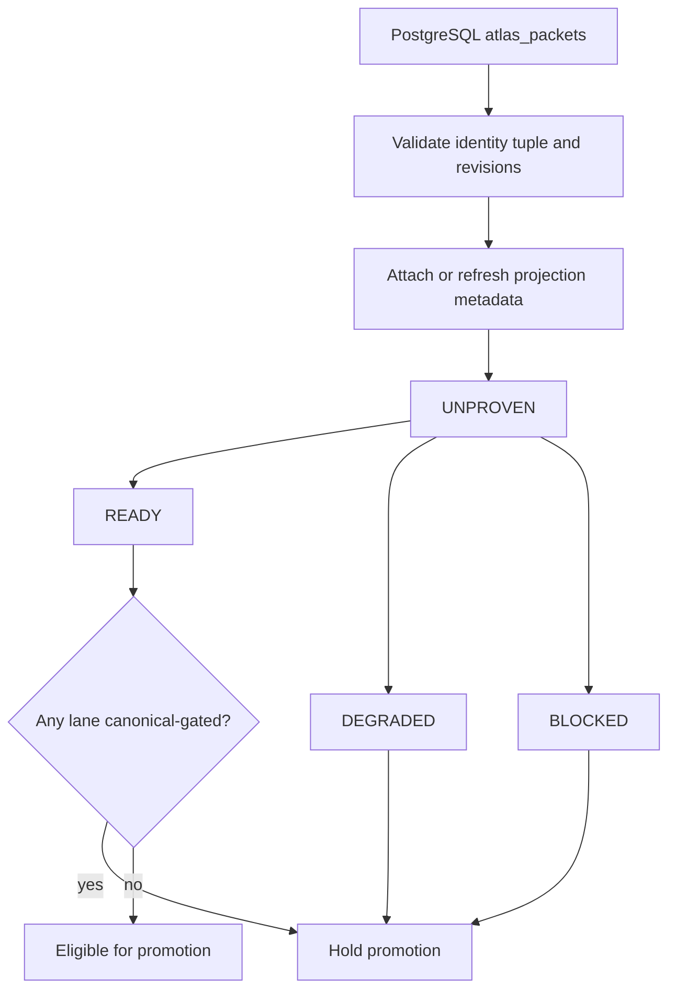

# Canonical Packet Registry and Projection Health

The packet registry is an index of packet identity and derived representations; it is not an independent source of packet identity. PostgreSQL `atlas_packets` remains authoritative, and every registry or projection row must resolve to its canonical `packet_key`. This distinction is important because the design document describes a broad, lifecycle-oriented `atlas_packet_registry`, while the current implementation exposes an additive projection table and RPC contracts rather than a proven single writer for every registry mutation.

- [Packet identity and provenance](./packet-identity-and-provenance.md) explains the canonical identity axes in more detail.
- [Contracts and boundaries](../testing/contracts-and-boundaries.md) is the companion testing page.
- [Graphify ingestion](../workflows/graphify-ingestion.md) describes an ingestion workflow that produces packet authority.
- The source proposal is [PACKET-CENTRIC-ARCHITECTURE.md](../../docs/PACKET-CENTRIC-ARCHITECTURE.md).

## Authority and identity spine

The live Drizzle model names `atlas_packets` as the canonical Postgres table. Its packet row carries `packet_id`, `packet_key`, `source_ref`, `feature_id`, content hashes and revisions, workspace and representation revisions, embedding lineage, and external references such as `qdrant_point_id`, `neo4j_node_id`, and `tree_node_id` ([atlas-packets.ts](../../sveltekit-frontend/src/lib/server/db/schema/atlas-packets.ts#L30-L44), [atlas-packets.ts](../../sveltekit-frontend/src/lib/server/db/schema/atlas-packets.ts#L65-L85), [atlas-packets.ts](../../sveltekit-frontend/src/lib/server/db/schema/atlas-packets.ts#L102-L137)). These columns make it possible to validate that a derived lane is attached to the right packet and revision instead of allowing a projection to invent identity.

The registry contract makes that rule explicit with a canonical identity tuple:

- `workspaceId` and `workspaceRevision`
- `packetKey` and `packetRevision`
- `sourceRef` and `sourceRevision`
- `contentHash` (a 64-character hexadecimal digest)

The tuple is strict and requires the `atlas.rpc-packet-registry.v1` schema marker. Empty identity values and malformed digests are rejected by the Zod contract ([rpc-packet-registry-v1.ts](../../sveltekit-frontend/src/lib/server/atlas/contracts/rpc-packet-registry-v1.ts#L3-L32)). A packet revision is therefore not interchangeable with a source revision or workspace revision; consumers should retain all axes when building cache keys, manifests, or replay receipts.

The lower-level registry constants provide a separate safety rule for backfills: `packet_key`, `source_ref`, `feature_id`, `tree_node_id`, and `qdrant_point_id` are read-only identity columns, and runtime checks must abort if a backfill attempts to place one in an `UPDATE` set. A title backfill may write only `title_id`, `title_generator_version`, and `updated_at` ([packet-registry.mjs](../../packages/atlas/lib/packet-registry.mjs#L14-L39)). This is a permitted enrichment lane, not permission to rewrite packet identity.

## Registry-to-projection relationship

The current additive schema models lane metadata in `atlas_packet_registry_projections`. Each projection has a `projection_id`, a required `packet_key` foreign key to `atlas_packets.packet_key`, a lane and owner, status, representation and model revisions, collection/vector metadata, index metadata, checksum, and write policy. It also indexes packet, lane, and status for operational inspection ([atlas-packet-registry.ts](../../sveltekit-frontend/src/lib/server/db/schema/atlas-packet-registry.ts#L5-L36)).

This diagram shows the supported relationship: a projection attaches to an authoritative packet; it does not replace the packet row or become an identity generator.

The separate `packet_binary_registry` is transport storage, not canonical packet authority. It keeps binary envelopes and DAG-hit snapshots separate from the Postgres packet row, uses `packet_key` as a stable lookup key, retains `packet_id` as the Postgres row identity, and optionally records `packet_ulid` ordering lineage ([packet-binary-registry.ts](../../sveltekit-frontend/src/lib/server/db/schema/packet-binary-registry.ts#L15-L27)). Its unique `packet_key`, payload, TTL, transport, and access fields should be treated as transient or operational metadata, not as a second identity system ([packet-binary-registry.ts](../../sveltekit-frontend/src/lib/server/db/schema/packet-binary-registry.ts#L28-L60)).

## Lane descriptors and permitted writes

The RPC lane descriptor is deliberately descriptive. A lane declares:

- one of the supported kinds: `bm25_pg_fts`, `pgvector`, `qdrant_dense`, `qdrant_sparse`, `cuvs_rapids`, or `fastapi_gpu`;
- its `laneId`, `owner`, status, representation/model revisions, collection and vector name;
- tags, index algorithm and revision, and an optional projection checksum; and
- a write policy of `READ_ONLY`, `PROJECTION_ONLY`, or `CANONICAL_GATED` ([rpc-packet-registry-v1.ts](../../sveltekit-frontend/src/lib/server/atlas/contracts/rpc-packet-registry-v1.ts#L34-L49)).

The policy is a safety boundary, not merely documentation. A registry entry is promotion-eligible only when it has at least one lane, every lane is `READY`, and no lane is `CANONICAL_GATED` ([rpc-packet-registry-v1.ts](../../sveltekit-frontend/src/lib/server/atlas/contracts/rpc-packet-registry-v1.ts#L80-L86)). Thus a ready projection can be consumed without being granted authority to mutate `atlas_packets`; a canonical-gated lane requires an explicit admission path outside this predicate.

The status vocabulary is `READY`, `DEGRADED`, `BLOCKED`, and `UNPROVEN`. The projection table defaults new rows to `UNPROVEN`, uses `PROJECTION_ONLY` as its default write policy, and defaults its index algorithm to `NONE` ([atlas-packet-registry.ts](../../sveltekit-frontend/src/lib/server/db/schema/atlas-packet-registry.ts#L18-L30)). Operators should read `UNPROVEN` as “not admitted for promotion,” not as a successful but empty lane.

### Lifecycle and safety gate

This lifecycle describes admission semantics represented by the contract; it does not claim that every transition is currently implemented as a database workflow.

## Documented design versus current implementation

The architecture document proposes one wide `atlas_packet_registry` containing identity, summaries, embeddings, latent vectors, clustering, service references, ranking, retrieval metrics, cache state, activity, status, timestamps, and relationship JSON. It also proposes that embedding, indexing, and retrieval services update those fields and that a single query replace multi-service health checks ([PACKET-CENTRIC-ARCHITECTURE.md](../../docs/PACKET-CENTRIC-ARCHITECTURE.md#L11-L74), [PACKET-CENTRIC-ARCHITECTURE.md](../../docs/PACKET-CENTRIC-ARCHITECTURE.md#L78-L118), [PACKET-CENTRIC-ARCHITECTURE.md](../../docs/PACKET-CENTRIC-ARCHITECTURE.md#L122-L162)). Those are documented design goals, not proof that the entire wide table or atomic multi-service update protocol is live.

The current source instead provides an additive projection schema, strict RPC contracts, and identity/write-safety constants. The writer-ownership report is explicitly `READ_ONLY` and records no writes. Its reported parity snapshot shows 61,718 `atlas_packets` rows and 61,718 registry rows, with zero missing registry rows, orphan rows, or duplicate registry keys; this is a report result, not a permission to modify a datastore ([packet-registry-writer-ownership-v1.json](../../docs/reports/packet-registry-writer-ownership-v1.json#L2-L16)).

The same report says the target gate is not satisfied: there are four canonical-writer candidates, two production-capable unowned paths, and no explicit owners for packet-key derivation, source revision, workspace revision, or conflict policy ([packet-registry-writer-ownership-v1.json](../../docs/reports/packet-registry-writer-ownership-v1.json#L17-L45)). It classifies 80 paths as projection writers and 21 as migration-only, while listing 13 dry-run-reachable mutation paths ([packet-registry-writer-ownership-v1.json](../../docs/reports/packet-registry-writer-ownership-v1.json#L30-L60)). Consequently, “registry health” currently means that readback and contract checks can establish linkage and admission metadata; it must not be read as proof of one-owner runtime mutation semantics.

## Focused tests and operational gates

The contract tests cover the important boundaries rather than only checking object construction:

- the canonical identity tuple accepts valid revisions and rejects an empty `packetRevision`;
- semantic AST packets reject inverted byte spans; and
- a `READY` lane with `CANONICAL_GATED` write policy is not promotion-eligible ([rpc-packet-registry-v1.spec.ts](../../sveltekit-frontend/src/lib/server/atlas/contracts/rpc-packet-registry-v1.spec.ts#L20-L65)).

For safe changes, preserve these gates and add tests for any new lane kind, status, write policy, identity axis, or projection reference. Repository-supported verification should be read-only: validate the RPC schemas, inspect packet-to-projection foreign-key resolution, compare registry parity reports, and review writer inventory. Do not apply live DDL, migrations, or backfills from this page. The report's `writesPerformed: false` and the schema comment “do not apply live DDL until an explicit migration is authorized” are intentional safety controls ([packet-registry-writer-ownership-v1.json](../../docs/reports/packet-registry-writer-ownership-v1.json#L2-L7), [atlas-packet-registry.ts](../../sveltekit-frontend/src/lib/server/db/schema/atlas-packet-registry.ts#L5-L9)).

## Practical invariants

1. Resolve `packet_key` to `atlas_packets` before trusting any registry lane, binary envelope, external reference, score, or cache state.
2. Never rewrite the immutable identity spine from an enrichment or projection worker.
3. Keep `sourceRevision`, `workspaceRevision`, `packetRevision`, and representation/model revisions distinct; a matching packet key alone is insufficient for replay or cache validity.
4. Treat `UNPROVEN`, `DEGRADED`, `BLOCKED`, and canonical-gated lanes as non-promotable until the contract predicate and an authorized admission path say otherwise.
5. Treat the wide all-in-one registry and “every service updates the registry atomically” behavior as a documented proposal until a read-only implementation audit proves the corresponding owner and mutation path.
