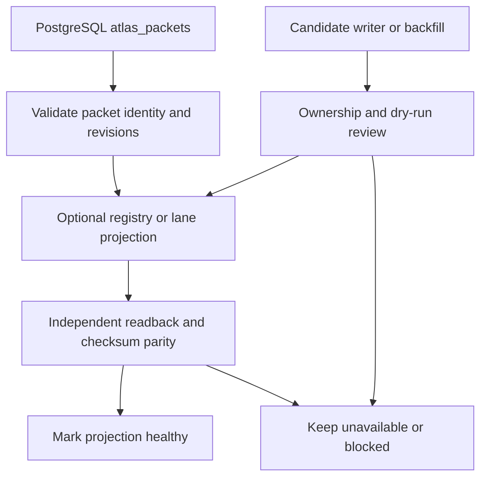

# Evidence Status and Known Gaps

This page is the evidence ledger for Parent Atlas. It distinguishes what the repository demonstrates from what a design proposes, what is safe only as a read-only experiment, and what still needs a live-state check. PostgreSQL remains the packet/source/workspace authority; Qdrant, Neo4j, Redis/Valkey, DuckDB, executors, and RPC surfaces are downstream or optional unless a source explicitly proves otherwise.

## Status vocabulary

- **[proven]** Source, schema, focused test, or a read-only report directly establishes the behavior. “Proven” here means repository evidence, not an assertion that every deployment has the same state.
- **[experimental]** An implemented or reachable lane whose operational result, parity, or production ownership is still bounded by a gate.
- **[blocked]** A migration or operation must not proceed until a named contract, owner, or verification gate is satisfied.
- **[proposed]** A design decision or future interface; it is not live merely because types or a spec exist.
- **[unknown]** The repository does not establish the live answer; follow-up is stated explicitly.

## Executive ledger

| Area | Status | Current evidence and safe interpretation |
|---|---|---|
| Packet identity and source provenance | **[proven]** | `atlas_packets` models PostgreSQL as the canonical identity spine, with `packet_id`, `packet_key`, `source_ref`, `feature_id`, source/workspace revisions, and representation revisions. |
| Registry parity snapshot | **[proven]** | The read-only September 2026 census reports 61,718 `atlas_packets` and 61,718 registry rows, with zero missing registry rows, orphan rows, or duplicate registry keys. This proves that snapshot only; it does not prove writer ownership. |
| Registry writer ownership | **[blocked]** | The ownership report finds four runtime canonical-writer candidates, two production-capable unowned writers, and no explicit owners for packet-key, source-revision, workspace-revision, or conflict policy. Do not authorize a backfill or promotion from parity alone. |
| Registry projection contract | **[proposed]** | The OpenSpec design and additive Drizzle schema describe a projection relation keyed back to `atlas_packets`, with lane, representation, model/index revision, checksum, and projection-only write policy. The schema comment explicitly says live DDL awaits authorization. |
| Evaluation readiness | **[experimental]** | The measurement framework and weak labels exist, but the corrected status says the per-query audit, immutable dataset freeze, query-level splits, baseline metrics, and reproducible run records remain before Gate 1 closure. |
| Optional GPU and retrieval lanes | **[experimental]** | Architecture notes describe Qdrant, Neo4j, Redis/Valkey, TurboVec, Go retrieval, and GPU executors as active or optional, but report-backed verification and parity receipts remain the authority for migration decisions. |
| Live service/database state | **[unknown]** | Documentation contains dated counts and environment claims. This page performs no datastore access or service refresh; current deployment state must be checked through an explicitly authorized read-only audit. |

## Canonical authority and identity invariants

**[proven] PostgreSQL packet records carry the canonical identity and revision axes.** The `atlas_packets` schema calls PostgreSQL the “canonical — Postgres is truth” identity spine and defines `packet_id`, `packet_key`, `source_ref`, `feature_id`, `workspace_revision`, `representation_revision`, and `source_revision`. `qdrant_point_id`, `neo4j_node_id`, and cache references are fields on that record, not alternate identity stores. Evidence: `repo://sveltekit-frontend/src/lib/server/db/schema/atlas-packets.ts#L30-L44`, `repo://sveltekit-frontend/src/lib/server/db/schema/atlas-packets.ts#L74-L76`, `repo://sveltekit-frontend/src/lib/server/db/schema/atlas-packets.ts#L102-L137`.

**[proven] Identity validation is intended to fail closed on the packet triple.** The canonical bridge extracts `packet_key`, `source_ref`, and `feature_id`, validates required fields, and reports mismatches rather than silently merging rows. It accepts rows from either `atlas_packets` or `atlas_packet_registry`, so the bridge is an interoperability guard, not proof that the two tables have equal authority. Evidence: `repo://packages/parent-atlas/src/core/canonical-packet-bridge.ts#L29-L55`, `repo://packages/parent-atlas/src/core/canonical-packet-bridge.ts#L57-L86`.

**[proven] The intended registry invariant is projection parity, not identity generation.** The writer-ownership report states that `atlas_packets.packet_key` must equal `atlas_packet_registry.packet_key` and calls the registry an admitted projection/index. Its read-only census reports 61,718 rows on both sides, zero missing packet-to-registry rows, zero orphan registry rows, and zero duplicate registry keys. Evidence: `repo://docs/reports/packet-registry-writer-ownership-v1.json#L8-L16`, `repo://docs/reports/atlas-packet-registry-gap-ws1.4.json#L204-L219`.

**[blocked] Identity ownership is not yet safe to promote.** The same ownership report says there are four runtime canonical-writer candidates and two production-capable unowned paths; packet-key, source-revision, workspace-revision, and conflict-policy ownership are all not explicit. A parity count cannot resolve those lifecycle conflicts. Evidence: `repo://docs/reports/packet-registry-writer-ownership-v1.json#L17-L45`.

## Registry layers and contradiction ledger

There are two materially different registry representations in the repository:

1. `atlas-packets` is the current canonical packet schema and contains packet content, source identity, revisions, embeddings, and mirror references.
2. `atlas_packet_registry` is also declared in a legacy-looking Drizzle schema whose module comment says it is “canonical truth for all packet state” and that every service reads/writes it.
3. `atlas_packet_registry_projections` is a separate additive schema intended to attach lane/projection descriptors to `atlas_packets` without altering the packet table.

**[unknown] The repository does not resolve which registry schema is the live operational owner.** This is a direct contradiction between the current `atlas_packets` schema, the older `atlas_packet_registry` schema comment, the OpenSpec decision that PostgreSQL owns identity through `atlas_packets`, and the report’s classification of the registry as a projection/index. It must be resolved by a read-only live schema audit and writer call-chain review, not by choosing the newest document. Evidence: `repo://sveltekit-frontend/src/lib/server/db/schema/atlas-packets.ts#L30-L44`, `repo://sveltekit-frontend/src/lib/server/db/schema-atlas-registry.ts#L1-L6`, `repo://sveltekit-frontend/src/lib/server/db/schema-atlas-registry.ts#L22-L30`, `repo://openspec/changes/parent-atlas-rpc-packet-registry-fabric/design.md#L37-L47`.

**[proposed] A future projection table may reference canonical packets while remaining projection-only.** The additive schema uses a foreign key from `atlas_packet_registry_projections.packet_key` to `atlas_packets.packet_key` and stores lane, owner, status, representation/model/index revisions, collection, tags, checksum, and `write_policy` defaulting to `PROJECTION_ONLY`. Its own comment prohibits live DDL until explicit authorization. Evidence: `repo://sveltekit-frontend/src/lib/server/db/schema/atlas-packet-registry.ts#L5-L30`.

**[proposed] RPC should carry qualified packets and receipts, not become an authority.** The OpenSpec design proposes caller-owned workspace/packet revisions, source references, AST spans, parser/grammar revisions, and receipts; it separates read-only semantic-AST RPC from a future gated producer-admission path. Evidence: `repo://openspec/changes/parent-atlas-rpc-packet-registry-fabric/design.md#L39-L47`.

## Writer and migration risk

The read-only gap report enumerates several writers with materially different safety profiles: a no-dry-run backfill classified `UNSAFE_DEFAULT_WRITE_REVIEW_REQUIRED`; mixed-source upsert scripts; a broken-or-legacy source script; and a production-capable materializer requiring review. The report explicitly says `writesPerformed: false` and `safeToBackfill: false`. Evidence: `repo://docs/reports/atlas-packet-registry-gap-ws1.4.json#L1-L7`, `repo://docs/reports/atlas-packet-registry-gap-ws1.4.json#L221-L314`.

**[blocked] Do not run packet-registry backfills as routine repair.** The safe next gate is `WS1.4-WRITER-OWNERSHIP-AND-GAP-CLASSIFICATION`; the report classifies legacy pre-registry state, writer bypass, failed backfill, and current writer bug as unproven. This means “no current gap in the census” must not be turned into “the migration is safe.” Evidence: `repo://docs/reports/atlas-packet-registry-gap-ws1.4.json#L317-L325`.

**[experimental] Read-only and dry-run paths are the appropriate investigation boundary.** The ownership report found 13 dry-run-reachable mutation paths, including registry backfill, source-ref repair, health checks, Neo4j synchronizers, phase-D ingestion, and promotion workers. Reachability is evidence that review is needed, not evidence that any path has been executed successfully. Evidence: `repo://docs/reports/packet-registry-writer-ownership-v1.json#L47-L62`.

*This flow shows the evidence boundary: a writer reaches a projection only after ownership review, and health follows independent parity readback.*

## Measurement and evaluation gaps

**[experimental] The measurement framework exists, but Gate 1 is not closed.** The corrected project status records weak labels with grades 0–3, feature-grade correlation of 0.909, and query variance for 100% of queries, while leaving per-query diversity audit, dataset versioning, train/validation/test splits, baseline NDCG@5/Recall@20/MRR, and reproducible evaluation-run metadata pending. Evidence: `repo://PROJECT-STATUS-CORRECTED.md#L18-L28`, `repo://PROJECT-STATUS-CORRECTED.md#L69-L82`.

**[proposed] Evaluation data and model artifacts should be immutable and versioned.** The status document proposes `dataset_v1`, later labeled datasets, separate model versions, and evaluation runs recording git commit, model, dataset, feature, and embedding versions. These are operating requirements for reproducibility, not evidence that the baseline has been collected. Evidence: `repo://PROJECT-STATUS-CORRECTED.md#L167-L194`.

**[blocked] Domain classification, canonical Qdrant work, Neo4j enrichment, and CrossEncoder work are not prerequisites for baseline XGBoost.** The corrected ordering treats them as later features or optimizations; baseline training waits on the per-query audit, dataset freeze, splits, and baseline evaluation infrastructure instead. Evidence: `repo://PROJECT-STATUS-CORRECTED.md#L41-L65`, `repo://PROJECT-STATUS-CORRECTED.md#L84-L88`.

## Retrieval, mirrors, and optional lanes

**[proven] The documented architecture separates PostgreSQL truth from mirrors and retrieval services.** The architecture record identifies PostgreSQL packet/source records, Qdrant vectors, Redis/Valkey caches, Neo4j topology, and DuckDB analytics, while explicitly describing Qdrant as a mirror and recording incomplete or planned coverage in places. Evidence: `repo://docs/VERIFIED-VS-PLANNED-ARCHITECTURE.md#L8-L24`, `repo://docs/VERIFIED-VS-PLANNED-ARCHITECTURE.md#L57-L118`.

**[experimental] A mirror or executor is not automatically a second vote or authority.** The OpenSpec design proposes one logical lane per executor family, revisioned lane descriptors, SearchRuntime-owned normalization/fusion, and deduplication when mirrors contain the same packet. It also requires explicit unavailable receipts when an optional GPU lane is down. Evidence: `repo://openspec/changes/parent-atlas-rpc-packet-registry-fabric/design.md#L49-L57`, `repo://openspec/changes/parent-atlas-rpc-packet-registry-fabric/design.md#L68-L79`.

**[blocked] Planned backfills require report-backed verification.** The verified-vs-planned record says a feature is not “done” until its report exists and gives Qdrant backfill and CouchDB archival as planned examples with explicit coverage/count gates. Evidence: `repo://docs/VERIFIED-VS-PLANNED-ARCHITECTURE.md#L200-L229`.

## Follow-up questions and exact next checks

1. **[unknown] Which table is the live packet identity owner?** Compare `to_regclass`, primary/foreign-key constraints, recent write timestamps, and application import call chains for `atlas_packets`, `atlas_packet_registry`, and any projection table. Do not infer from schema comments.
2. **[unknown] Who owns each mutation boundary?** Resolve the four canonical-writer candidates and the two production-capable unowned paths in the ownership report; assign packet-key, source-revision, workspace-revision, and conflict-policy owners.
3. **[blocked] Is any registry migration authorized?** Require an approved migration, dry-run output, transaction/rollback plan, and before/after parity report. The supplied reports performed no writes and explicitly mark backfill unsafe.
4. **[unknown] What is the current evaluation dataset state?** Run the named per-query audit, then record immutable dataset/split/run identifiers and held-out baseline metrics.
5. **[unknown] Which optional lane is actually available in the target deployment?** Use capability and health receipts rather than dated architecture prose; preserve PostgreSQL read-only behavior when GPU or mirror services are unavailable.

Related reading: [System Map](../architecture/system-map.md), [Packet Registry](../concepts/packet-registry.md), and [Safe Rebuilds and Failure Handling](../operations/safe-rebuilds-and-failure-handling.md).
