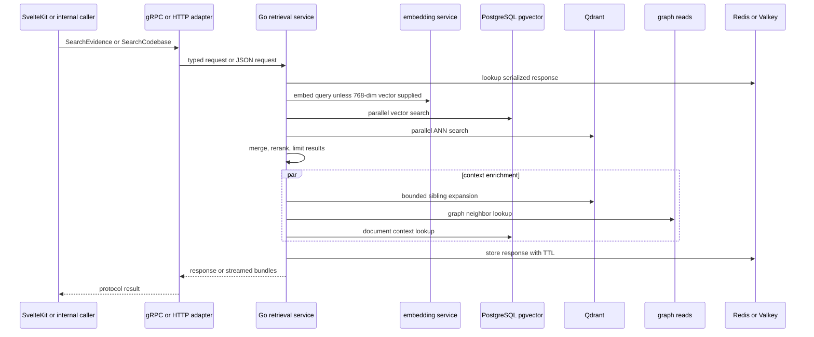

# Protocol and Service Adapters

Parent Atlas follows one important rule: **protocols are replaceable adapters; the canonical runtime owns retrieval behavior and PostgreSQL owns durable packet, source, and workspace authority**. HTTP, gRPC, MCP, A2A, tRPC/SvelteKit, GPU HTTP, Redis/Valkey, Qdrant, Neo4j, Ollama, and generated protobuf code therefore have different responsibilities. A caller should select a surface by interaction shape, not by reimplementing retrieval inside that surface.

## Callers and ownership

| Surface | Primary caller | Adapter responsibility | Authority boundary |
|---|---|---|---|
| SvelteKit/tRPC server routes | Browser and application UI | Validate application input, establish runtime context, call a downstream service, serialize the result | Not a ranking or packet writer |
| Go `RetrievalService` gRPC | SvelteKit server adapters and internal services | Typed low-latency retrieval, streaming, health, and read-only registry lookups | Reads PostgreSQL/Qdrant/graph/cache; no canonical write path |
| Go retrieval HTTP | Diagnostics and HTTP fallback callers | JSON equivalents of health and search endpoints | Same retrieval ownership as gRPC |
| FastAPI `atlas-gpu-8098` | GPU orchestration and artifact-processing callers | Execute bounded CUDA/RAPIDS operations on supplied artifacts | Explicitly execution-only; PostgreSQL, Qdrant, and Valkey writes are false |
| MCP | Agents and model tool loops | Expose bounded tools through JSON-RPC/streamable transport | Tool projections must delegate; low-level storage adapters are not tools |
| A2A | Agent-to-agent multihop callers | Submit tasks, discover an Agent Card, and stream artifacts | A protocol projection; promotion and canonical writes remain server-side |
| Qdrant | Go retrieval and indexing services | Vector projection/search | Projection IDs are not canonical identity |
| Neo4j | Retrieval graph enrichment | Read graph neighbors and topology context | Graph enrichment does not replace PostgreSQL source/workspace authority |
| Redis/Valkey | Go retrieval cache | Cache serialized retrieval responses and health state | Ephemeral cache only |
| Ollama | Model/embedding deployments outside the active retrieval path | Potential model host | The Go retrieval query path deliberately does not use direct Ollama fallback |

The package layering is deliberate. Core contracts contain serializable types and policies; runtime adapters implement retrieval and infrastructure I/O; `packages/parent-atlas-client` contains transport clients and transport errors; agent wrappers sit above clients. A client must not import server runtime business logic, and an adapter must not silently promote a projection identifier into canonical identity.

## Retrieval request sequence

The implemented Go service is the most concrete protocol boundary. `proto/active/retrieval.proto` defines `yorha.retrieval.RetrievalService`, including unary and streaming evidence/codebase searches, topology and research lookups, read-only semantic/registry methods, and health. The Go server listens on gRPC (default `GRPC_PORT=50053`) and HTTP (default `HTTP_PORT=8100`).

*This sequence shows the implemented retrieval adapter flow; context enrichment is read-oriented and overlapped after reranking.*

`SearchEvidence` applies a request timeout and bounds the requested limit. It checks the protobuf-binary Redis cache, embeds through the configured embedding service (or accepts a 768-dimensional client embedding), searches pgvector and Qdrant in parallel, merges and reranks, then performs bounded sibling, graph-neighbor, and document-context reads in parallel. `StreamEvidence` sends progress, delegates to the same unary search, and emits bundles; it does not implement a second ranking algorithm. Qdrant failure and enrichment errors are treated as degradable retrieval inputs, while embedding failure returns an empty response rather than inventing results.

`SearchCodebase` is a separate typed lane. It resolves and reports the representation actually used, makes representation fallback explicit, can constrain Qdrant by packet keys, and returns source/revision/representation lineage plus an Atlas receipt. A requested representation whose query encoder is not live must not silently become the default representation. `GetSemanticAstPackets` and `GetPacketRegistry` currently fail closed with explicit receipt errors because the service has no admitted canonical packet-revision producer; they are **implemented boundary stubs, not available registry readers or writers**.

## SvelteKit, tRPC, and generated protobufs

The SvelteKit server is an application-facing adapter layer. Its server contracts carry revision-qualified runtime context, packet keys, candidate identity, receipts, and validation outcomes. The `go-retrieval-grpc-client.ts` module is a transport bridge: it creates and closes a gRPC channel from `GO_RETRIEVAL_GRPC_URL`, forwards workspace/run metadata, requires a revision-qualified `AtlasRuntimeContext`, and falls back to HTTP when a gRPC call fails.

That file still declares a mock `RetrievalServiceClient` and contains TODOs for loading the actual proto and constructing a generated stub. Treat this TypeScript gRPC client as **proposed/partial**, not proof that the SvelteKit path currently invokes every method in `retrieval.proto`. Its HTTP fallback mirrors the live snake_case `/search/codebase` response and validates receipts rather than claiming ProtoJSON behavior.

The generated Go surface is produced from `proto/active/retrieval.proto` by `services/go-retrieval-service/generate.sh`. Regenerate both Go message and gRPC files when the proto changes; do not hand-edit generated files or change only one language's projection. Protobuf fields intentionally carry canonical packet/source/revision metadata, but transport presence is not authority: a response with no proven candidate bridge must leave canonical identity empty.

`tRPC` routes and SvelteKit endpoints should remain thin callers of these contracts and adapters. The same rule applies to planned Mastra/LangGraph integrations: they may orchestrate tools and consume projections, but no direct durable write is permitted unless a separately evidenced, controlled promotion path is present. Current source supports the adapter boundary and contract tests; it does not establish a live Mastra-owned retrieval or persistence adapter, so that integration remains **proposed/unknown**.

## MCP and A2A

MCP is the tool-call boundary for agents and models. The repository's MCP server package uses `McpServer`, a Valibot JSON-schema adapter, and handler registration for tools, resources, and prompts. Atlas-facing MCP tools should expose bounded operations such as retrieval or validation, not Qdrant calls or database mutation primitives. Network/protocol failures belong to transport errors and retry policy; a domain tool result marked as an error must remain visible to the agent rather than being converted into a successful result.

A2A is intentionally different. `packages/parent-atlas-client/src/a2a/client.ts` implements `RetrievalFacade` as a thin task-delegation adapter: it posts a task to an agent endpoint, supports Agent Card discovery at `/.well-known/agent.json`, accepts bearer authentication, maps completed artifacts to a retrieval result, and can consume either JSON or SSE task events. It is appropriate for long-running multihop investigations and progress/artifacts; direct RetrievalFacade/HTTP/gRPC is appropriate for a small synchronous search. The client returns protocol projections and explicitly leaves canonical writes behind server-side validation and promotion gates.

## GPU, storage, and model adapters

`services/atlas-gpu-8098/app.py` is a FastAPI host for execution, not a data owner. It validates artifact paths under an allowed root, reads Arrow IPC artifacts, checks vector shape and CUDA availability, optionally validates a shared residency lease, and exposes bounded inspection, enrichment, graph, and clustering routes. Health reports `writes: {postgres: false, qdrant: false, valkey: false}`. GPU results therefore must be treated as derived execution output that a controlled runtime may validate and promote; the GPU service itself cannot mutate durable identity.

The Go retrieval service uses PostgreSQL as the required database, Qdrant for vector projections, and Redis or Valkey for a TTL cache (`RETRIEVAL_CACHE_TTL`, default 300 seconds). Health checks probe pgvector, Qdrant, Redis, and the configured embedding service concurrently. The active embedding path is the configured Go embedding service (`EMBED_SERVICE_URL`/`EMBEDDING_BASE_URL`), defaulting to port 8097. `OLLAMA_URL`, `GPU_EMBED_ENABLED`, and `EMBEDDING_REQUIRE_GPU` are explicitly ignored by query embedding and cannot enable an unqualified fallback. Ollama may be deployed elsewhere, but it is not an authority or an implicit retrieval dependency.

## Safe extension and failure rules

When adding an adapter:

1. Add or reuse a core contract; keep protocol parsing and serialization at the edge.
2. Delegate business behavior to the canonical runtime or an admitted service implementation.
3. Preserve packet keys, source references, workspace revisions, and representation revisions; never infer canonical identity from a Qdrant point ID.
4. Return explicit unavailable/fallback receipts when an encoder, registry join, or service is not available.
5. Keep writes behind PostgreSQL-owned promotion/validation paths. MCP, A2A, Mastra, LangGraph, SvelteKit clients, GPU hosts, Qdrant, Redis/Valkey, and protocol clients are not direct durable authorities.
6. Add focused tests for wire shape, fallback/error semantics, identity propagation, representation routing, receipts, and health behavior. Existing Go tests cover lanes, embedding ownership, identity propagation, representation routing, Qdrant lineage, receipts, and registry adapters; A2A wire tests cover task/artifact shape and fail-closed identity mismatches.

For operations, configure `DATABASE_URL`, Qdrant URL/host/port, `REDIS_URL` or `VALKEY_URL`, embedding service URL, gRPC/HTTP ports, and cache TTL. Verify `/health` and the gRPC `Health` method before diagnosing ranking behavior. A transport outage should produce a bounded transport failure or documented fallback; it must never cause a caller to write a guessed packet, workspace revision, or source record.
