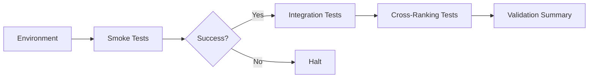

# Testing and Validation

Effective testing and validation of the ACE and Graphify pipelines are essential for ensuring system stability, retrieval accuracy, and correct architectural wiring. This document outlines the strategies and test types employed to verify these core components.

## Pipeline Testing Strategy

The system relies on a multi-layered testing approach designed to catch failures early in the development lifecycle and ensure end-to-end reliability.

### 1. Smoke Tests
Smoke tests are the first line of defense, designed to verify that the core components (ACE and Graphify services) can start and communicate with their dependencies (e.g., Redis, RabbitMQ, Qdrant).
- **Purpose:** Ensure system readiness.
- **Execution:** Automated startup checks run during environment initialization. 
- **Failure:** If smoke tests fail, the pipeline initialization is aborted to prevent operating in an inconsistent state.

### 2. Integration Tests
Integration tests verify the communication protocols and data exchange between services.
- **ACE Integration:** Tests the packet assembly, RPC communication, and data ingestion from the ACE workers into the vector store.
- **Graphify Integration:** Focuses on the temporal graph structure, verifying that daily runs correctly append and traverse the topology.
- **Mechanism:** Representative packets are sent through the queueing system, and the state of the downstream database (e.g., Qdrant or Neo4j) is verified against the expected outcome.

### 3. Cross-Ranking Tests
These tests validate the ranking algorithms used by the retrieval systems to ensure that relevant documentation matches user queries.
- **Mechanism:** A set of reference queries with known ideal results is used to calculate precision and recall.
- **Verification:** Changes to the ranking logic or embedding model must maintain or improve the performance on these test sets.

## Verification Procedures

Routine verification is performed through automation scripts found in the `scripts/` and `tests/` directories.



## Running Tests
Tests can be triggered via standard npm scripts or dedicated test files. Refer to the specific integration manifests for the pipeline under test.

For example, to run standard integration suites:
```bash
npm run test:integration
```
For deep-dive diagnostics on GPU-accelerated retrieval lanes, use the forensic analysis scripts located at:
`repo://FORENSIC-AUDIT-GPU-RETRIEVAL-LANE-2026-07-10.md`
