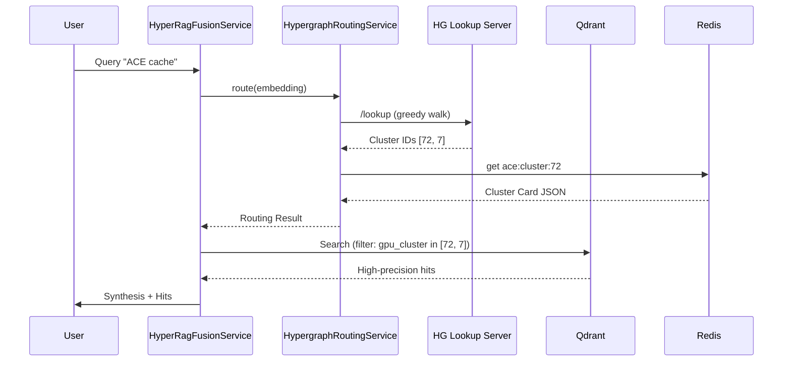

# Hypergraph Query Routing Architecture

## Overview
Hypergraph Query Routing is a precision-retrieval mechanism that uses topological codebase intelligence to guide vector search. Instead of a global search over millions of chunks, the system first identifies the dominant topological manifold (cluster) for a query and then performs a high-precision search within that manifold.

## Components

### 1. Hypergraph Lookup Server
A dedicated service that maintains a centroid neighbor graph. It performs a **Greedy Topology Search** ($O(\log K)$) to find the nearest cluster centroids to a query embedding.

### 2. HypergraphRoutingService
The orchestration layer within the SvelteKit backend that:
- Infers query profiles from text (e.g., "ace", "legal").
- Coordinates with the lookup server.
- Merges topological hits with profile-based cluster priors.
- Fetches "Cluster Cards" from Redis for immediate context injection.

### 3. HyperRagFusionService Integration
The primary retrieval service integrates routing as a "pre-filter" lane:
1. **Routing Phase**: Resolve query → top cluster IDs.
2. **Filtering Phase**: Apply `gpu_cluster` MUST filters to Qdrant.
3. **Fallback Phase**: If filtered search returns $< 3$ hits, retry with a broader unfiltered search.
4. **Synthesis Phase**: Inject cluster card distillates into the final reasoning prompt.

## Data Flow

## Benefits
- **Precision**: Eliminates semantic drift by staying within relevant code manifolds.
- **Latency**: Smaller search space in Qdrant leads to faster index traversal.
- **Explainability**: Provenance shows exactly which clusters guided the retrieval.
- **Resilience**: Fails open to standard dense retrieval if topological services are unavailable.
