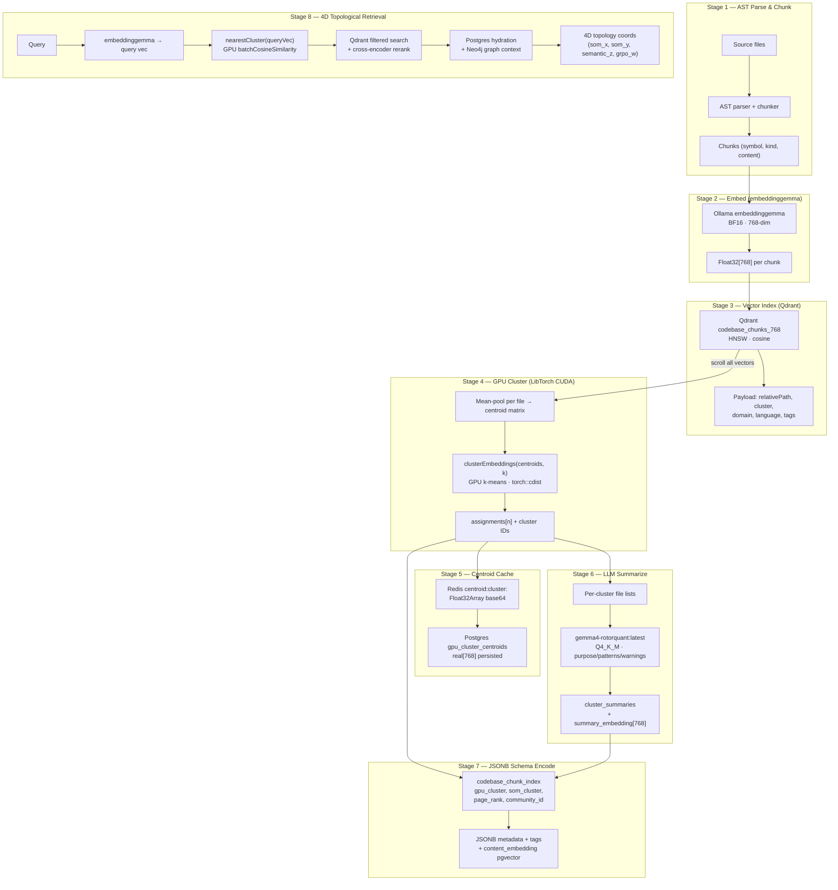
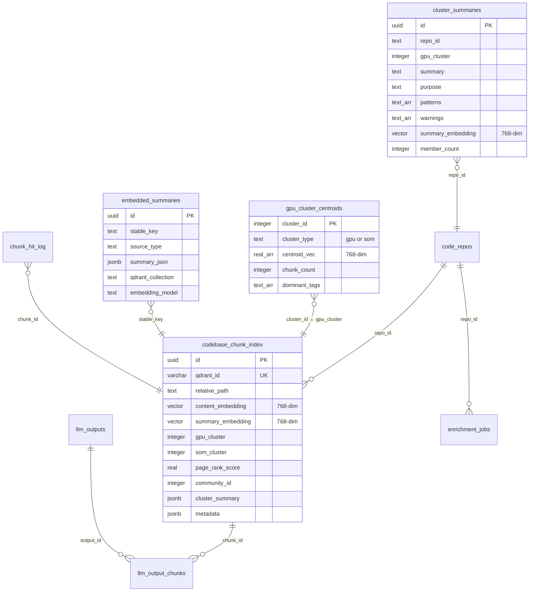

# CUDA Audit & GPU Wiring — Updated May 5, 2026 (20:30 PT)

> **Δ from March 9 audit** — items marked ✅ DONE were implemented, ⬡ OPEN remain.

**Hardware**: RTX 3060 Ti · 8 GB GDDR6 · SM 8.6 Ampere
**LibTorch**: 2.9.0+cu130 · cuDNN v9.16
**Addon**: `tensorrt_bridge.node` via CMake N-API

---

## 1. Kernel Inventory (was 4 → now 7)

| # | Kernel | File | Lines | Status |
|---|--------|------|-------|--------|
| 1 | `graphSimilarity` | `libtorch_graph.cc` | 64-96 | Hardened |
| 2 | `clusterEmbeddings` | `libtorch_graph.cc` | 103-160 | Partially fixed |
| 3 | `computeCaseEmbedding` | `libtorch_graph.cc` | 167-206 | Hardened |
| 4 | `checkCudaAvailable` | `libtorch_graph.cc` | 212-216 | Enhanced |
| 5 | **`getCudaMemory`** *(new)* | `libtorch_graph.cc` | 223-237 | New since audit |
| 6 | **`batchCosineSimilarity`** *(new)* | `libtorch_graph.cc` | 245-280 | New since audit |
| 7 | **`graphSimilarityHalf`** *(new)* | `libtorch_graph.cc` | 288-322 | New since audit |

### New kernels added post-audit

- **`getCudaMemory`** — `cudaMemGetInfo` wrapper returning free/total VRAM via BigInt64Array. Powers the OOM guard in the TS bridge.
- **`batchCosineSimilarity`** — query[1,dim] vs corpus[n,dim] → scores[n]. Optimized for reranking (avoids building full N×N matrix).
- **`graphSimilarityHalf`** — FP16 matmul path. Implements Phase 2 recommendation from original audit.

---

## 2. Recommendation Tracker

### ✅ DONE — Implemented since March audit

| Rec | What | Where |
|-----|------|-------|
| §1.1 FP16 option | `graphSimilarityHalf()` kernel added | `libtorch_graph.cc:288-322` |
| §1.1 NoGradGuard | All 3 original kernels now have `torch::NoGradGuard` | `libtorch_graph.cc:72,114,176` |
| §1.2 cdist | `clusterEmbeddings` now uses `torch::cdist(data, centroids, 2.0)` | `libtorch_graph.cc:130` |
| §1.3 NoGradGuard | `computeCaseEmbedding` has guard | `libtorch_graph.cc:176` |
| §4 checkCudaAvailable | Enhanced: returns 2=CUDA+cuDNN, 1=CUDA, 0=CPU | `libtorch_graph.cc:212-216` |
| §6 Phase 1 safety | VRAM OOM guard: `gpuHasRoom()` checks free VRAM before every GPU op | `libtorch-bridge.ts:275-288` |
| §6 Phase 1 safety | Min 256 MB VRAM headroom enforced (`CUDA_OOM_MIN_MB`) | `libtorch-bridge.ts:259` |
| §6 Phase 1 safety | Heap pressure guard for CPU fallback (`heapHasRoom()`) | `libtorch-bridge.ts:265-269` |
| §6 Phase 2 FP16 | `graphSimilarityHalf()` exposed end-to-end (C++ → TS → callers) | `libtorch-bridge.ts:673-704` |
| §6 Phase 3 cdist | Broadcasting distance replaced with `torch::cdist` | `libtorch_graph.cc:130` |
| New | Float32Array pool (6/bucket, pow2 sizing) — ~90% fewer GC pauses | `libtorch-bridge.ts:226-255` |
| New | Cache-blocked CPU cosine similarity (128-float tiles, 8× unrolled) | `libtorch-bridge.ts:299-373` |
| New | Chunked batch similarity for large corpora (4096-vector pages) | `libtorch-bridge.ts:651-667` |
| New | `queryBmuCached()` — SOM BMU with Redis 30-min cache | `libtorch-bridge.ts:764-800+` |
| New | cuDNN benchmark mode enabled at init | `libtorch_graph.cc:43-46` |
| New | Thread pinning: intra=min(4,hw), interop=min(2,hw) | `libtorch_graph.cc:29-48` |

### ⬡ OPEN — Not yet implemented

| Rec | What | Impact | Effort |
|-----|------|--------|--------|
| §1.1 Max-N guard | Hard cap on `graphSimilarity` input (n≤3000) in C++ | High — OOM | Low |
| §1.1 Tiled similarity | For n>4096, compute sub-matrices | Med | Med |
| §1.2 k-means++ init | GPU k-means still uses first-k-points, not D² seeding | Med — quality | Med |
| §1.2 Scatter centroid | Serial for-loop → single `scatter_add_` | Low — perf | Med |
| §1.2 Empty cluster | No re-seeding on member loss → NaN centroids | High — correctness | Low |
| §2 Async N-API | GPU calls block Node.js event loop | High — latency | High |
| §2 Error messages | Return codes (-1,-2,-3) have no `.what()` detail | Low — DX | Low |
| §5.1 GPU quality | Accept GPU k-means only when n>500 | Med — quality | Low |
| §5.3 Rerank threshold | Skip GPU reranking when results<100 | Low — perf | Low |
| §6 Phase 5 tensor cache | Redis-cached similarity matrices | Med — perf | High |

---

## 3. VRAM Budget

### Steady State

| Component | VRAM | Notes |
|-----------|------|-------|
| Ollama gemma4-rotorquant:latest | ~5.4 GB | Q4_K_M, primary model |
| Ollama embeddinggemma | ~0.6 GB | BF16, 768-dim output |
| CUDA context + cuDNN | ~0.3 GB | Driver + caching allocator |
| **Total steady** | **~6.3 GB** | **Leaves ~1.7 GB for ops** |

### Per-Op Cost

| Operation | n | Peak VRAM | Safe? |
|-----------|---|-----------|-------|
| `graphSimilarity` | 1000 | ~14 MB | ✅ |
| `graphSimilarity` | 3000 | ~36 MB output | ✅ |
| `graphSimilarityHalf` | 5000 | ~50 MB (FP16) | ✅ |
| `graphSimilarity` | 10000 | ~400 MB | ❌ exceeds budget |
| `clusterEmbeddings` (cdist) | 3000, k=15 | ~36 MB | ✅ |
| `batchCosineSimilarity` | 5000 | ~15 MB corpus | ✅ |
| `computeCaseEmbedding` | 50 | ~1 MB | ✅ |

> **Key improvement**: `clusterEmbeddings` VRAM dropped from ~220 MB (broadcast) to ~36 MB (cdist) for n=5000,k=15.

---

## 4. TS Bridge Architecture (libtorch-bridge.ts)

```
┌─────────────────────────────────────┐
│  Public API (async functions)       │
│  graphSimilarity()                  │
│  graphSimilarityHalf()              │
│  clusterEmbeddings()                │
│  computeCaseEmbedding()             │
│  batchCosineSimilarity()            │
│  batchCosineSimilarityChunked()     │
│  queryBmuCached()                   │
├─────────────────────────────────────┤
│  Guards                             │
│  gpuHasRoom(MB) → VRAM check       │
│  heapHasRoom(bytes) → V8 heap      │
│  CUDA_OOM_MIN_MB = 256             │
├─────────────────────────────────────┤
│  Float32Array Pool                  │
│  acquireFloat32(n) → reuse or alloc│
│  releaseFloat32(arr) → return pool │
│  6 per bucket, power-of-2 sizing   │
├─────────────────────────────────────┤
│  CPU Fallbacks                      │
│  cpuCosineSimilarity() — L2-blocked│
│  cpuKMeans() — 8× unrolled         │
│  cpuWeightedEmbedding()             │
├─────────────────────────────────────┤
│  N-API Addon (tensorrt_bridge.node) │
│  libtorch_graph.cc (7 exports)      │
│  lstm_bridge.cc / som_cache.cu      │
│  simdjson_bridge.cc                 │
└─────────────────────────────────────┘
```

---

## 5. Karpathy GPU Pipeline — End-to-End Flow

The complete pipeline from source code to 4D topological retrieval, showing how each GPU kernel, model, and data store connects.

### 5.1 Pipeline Architecture



### 5.2 Stage Details

#### Stage 1 — AST Parse & Chunk
**Files**: `indexer/karpathy-hook.ts`, `ast/svelte-check-analyzer.ts`

- TypeScript/Svelte files parsed into AST nodes
- Chunks created per symbol (function, class, route handler, component)
- Each chunk carries: `stableKey`, `filePath`, `kind`, `domain`, `tags`

#### Stage 2 — Embed via embeddinggemma
**Model**: Ollama `embeddinggemma:latest` · BF16 · ~0.6 GB VRAM · 768-dim output

- Every chunk's content → `POST /api/embed` → `Float32[768]` embedding
- Batch-embedded in pages of 32 (Ollama concurrency limit)
- Cached in Redis: `embed:embeddinggemma:latest:<content_hash>` (24h TTL)

#### Stage 3 — Qdrant Vector Index
**Collection**: `codebase_chunks_768` · HNSW cosine · Named vector `content`

- Each point stores the 768-dim embedding + payload:
  - `relativePath`, `cluster`, `domain`, `language`, `extension`
  - `semanticTags[]`, `lineStart`, `lineEnd`, `tokenCount`
- Scroll API used by Stage 4 to extract all vectors for clustering

#### Stage 4 — GPU K-Means Clustering
**Kernel**: `clusterEmbeddings()` · `libtorch_graph.cc:103-160`

1. Scroll all Qdrant points → group by file → mean-pool per file → centroid matrix
2. `k = min(20, ceil(sqrt(n_files)))` — auto-determined cluster count
3. GPU k-means via `torch::cdist` (was broadcasting, now memory-efficient)
4. Result: `assignments[n]` — which cluster each file belongs to
5. Neo4j update: `SET f.gpuCluster = assignment` on `CodebaseFile` nodes

#### Stage 5 — Centroid Cache & Persistence

| Layer | Key / Table | Data | TTL |
|-------|-------------|------|-----|
| Redis | `centroid:cluster:<id>` | `Float32Array[768]` as JSON | 6h |
| Redis | `centroid:som:<x>:<y>` | SOM cell centroid | 6h |
| Postgres | `gpu_cluster_centroids` | `real[768]` array | Permanent |

- `buildAndCacheCentroids()` averages all chunk embeddings per cluster → Redis
- `persistCentroidsToDB()` upserts Redis centroids → Postgres for durability
- `loadCentroidsFromDB()` warms Redis from Postgres on restart

#### Stage 6 — LLM Summarization
**Model**: gemma4-rotorquant:latest · Q4_K_M · ~5.4 GB VRAM

Per cluster, the LLM generates:
- `purpose` — what the cluster does
- `patterns[]` — dominant code patterns
- `warnings[]` — architectural risks
- `tags[]` — semantic labels
- `summary_embedding[768]` — embedded summary for cluster-level search

Stored in `cluster_summaries` table with `repo_id` + `gpu_cluster` as logical key.

#### Stage 7 — JSONB Schema Encode (Postgres)

The `codebase_chunk_index` table is the unified Postgres mirror:

| Column | Type | Source |
|--------|------|--------|
| `content_embedding` | `vector(768)` | embeddinggemma |
| `signature_embedding` | `vector(768)` | embeddinggemma (function sig) |
| `summary_embedding` | `vector(768)` | embeddinggemma (LLM summary) |
| `gpu_cluster` | `integer` | GPU k-means |
| `som_cluster` | `integer` | SOM topology |
| `neo4j_gpu_cluster` | `integer` | Neo4j cross-ref |
| `page_rank_score` | `real` | WebGPU PageRank |
| `community_id` | `integer` | Louvain community detection |
| `tags` | `jsonb` | Legacy tag array |
| `semantic_tags` | `text[]` | Karpathy atom labels |
| `cluster_summary` | `jsonb` | LLM-generated cluster context |
| `neo4j_meta` | `jsonb` | Graph topology metadata |
| `metadata` | `jsonb` | Flexible enrichment bag |

**Indexes** (8 total): `path`, `gpu_cluster`, `som_cluster`, `domain`, `language`, `extension`, `repo_id`, `neo4j_gpu_cluster`

#### Stage 8 — 4D Topological Retrieval

Query-time flow:

1. **Embed query** → embeddinggemma → `Float32[768]`
2. **Nearest cluster** → `nearestCluster(queryVec)` via Redis centroid cosine (GPU `batchCosineSimilarity` for >100 centroids)
3. **Qdrant filtered search** → filter by `gpu_cluster` or `som_cluster` + HNSW ANN on `content` vector
4. **Cross-encoder rerank** → Triton/local reranker scores top-K
5. **Postgres hydration** → join `codebase_chunk_index` for full metadata + `cluster_summary` context
6. **Neo4j graph context** → follow `IMPORTS`, `CALLS`, `SOM_SAME_CLUSTER` edges for 1-hop context
7. **4D topology coordinates** assembled:

| Dimension | Source | Meaning |
|-----------|--------|---------|
| `som_x` / `som_y` | SOM grid BMU | Topological position in self-organizing map |
| `semantic_z` | `page_rank_score` | Importance / centrality in the code graph |
| `grpo_w` | `community_id` | Louvain community membership |

### 5.3 Schema Relationship Map



### 5.4 Redis Key Architecture (Pipeline)

| Key Pattern | Value Type | TTL | Written By |
|-------------|-----------|-----|------------|
| `embed:embeddinggemma:latest:<hash>` | JSON `number[768]` | 24h | Ollama embed service |
| `centroid:cluster:<id>` | JSON `Float32Array[768]` | 6h | `buildAndCacheCentroids()` |
| `centroid:som:<x>:<y>` | JSON `Float32Array[768]` | 6h | SOM topology pipeline |
| `wiki:note:dir:<path>` | JSON `WikiNote` | 24h | Karpathy wiki |
| `wiki:note:file:<path>` | JSON `WikiNote` | 24h | Karpathy wiki |
| `cluster-summary:<k>:<id>` | JSON `ClusterNarrative` | 24h | LLM summarizer |
| `agents:dir:<relPath>` | Markdown string | 24h | agents-write endpoint |
| `som:weights` | Binary `Float32Array` | 12h | SOM training |
| `som:bmu:<hash>` | JSON `{bmuRow, bmuCol}` | 30m | `queryBmuCached()` |
| `turbo:<prefix_hash>` | JSON cached LLM response | 6h | Turbo prefix cache |
| `hg:rag_hits` | ZSET (sha8 → timestamp) | — | RAG hit logger |
| `rag:hit:<sha8>` | JSON hit blob | 6h | RAG hit logger |
| `rlpolicy:source_bias` | JSON `SourceBiasSnapshot` | 2h | Lane 4 feedback loop |

### 5.5 GPU Kernel → Pipeline Stage Mapping

| Kernel | Pipeline Stage | Caller |
|--------|---------------|--------|
| `clusterEmbeddings` | Stage 4 — GPU Cluster | `codebase-cluster-detection.ts` |
| `graphSimilarity` | Stage 4 — Cluster analysis | `pytorch-graph.ts` |
| `graphSimilarityHalf` | Stage 4 — Large-set clustering | `pytorch-graph.ts` |
| `batchCosineSimilarity` | Stage 5/8 — Centroid nearest | `centroid-cache.ts`, `qdrant-manager.ts` |
| `computeCaseEmbedding` | Stage 6 — Weighted fusion | `multimodal-fusion.ts` |
| `getCudaMemory` | All stages — OOM guard | `libtorch-bridge.ts` |
| `checkCudaAvailable` | Init — device detection | `libtorch-bridge.ts` |

---

## 6. Priority Action Items

### P0 — Correctness (do first)
1. **Empty cluster guard** in `clusterEmbeddings` — add `if (count == 0)` re-seed from farthest point. Current code produces NaN centroids.

### P1 — Safety
2. **Hard N-cap** in C++ — reject n>4096 in `graphSimilarity` with specific error code
3. **Async N-API** — wrap GPU calls in `napi_create_async_work` to unblock event loop for n>500

### P2 — Quality
4. **k-means++ init** — implement D² proportional seeding on GPU
5. **Scatter centroid update** — replace serial for-loop with `scatter_add_` + divide

### P3 — Performance
6. **Tiled similarity** — for n>4096, process in 2048×2048 blocks
7. **Tensor caching** — Redis-backed similarity matrix cache with content-hash keys

---

## 7. Files Reference

| File | Purpose |
|------|---------|
| [libtorch_graph.cc](file:///c:/Users/james/Videos/deeds-web-app/simd-bridge/cpp/libtorch_graph.cc) | 7 GPU kernels (322 lines) |
| [binding.cc](file:///c:/Users/james/Videos/deeds-web-app/simd-bridge/cpp/binding.cc) | N-API bridge (40K, all exports) |
| [CMakeLists.txt](file:///c:/Users/james/Videos/deeds-web-app/simd-bridge/cpp/CMakeLists.txt) | Build config (SM 86, LibTorch, CUDA) |
| [libtorch-bridge.ts](file:///c:/Users/james/Videos/deeds-web-app/sveltekit-frontend/src/lib/server/gpu/libtorch-bridge.ts) | TS bridge (1096 lines, OOM guards, pools) |
| [pytorch-graph.ts](file:///c:/Users/james/Videos/deeds-web-app/sveltekit-frontend/src/lib/server/gpu/pytorch-graph.ts) | Higher-level graph ops |
| [gpu-monitor.ts](file:///c:/Users/james/Videos/deeds-web-app/sveltekit-frontend/src/lib/server/gpu/gpu-monitor.ts) | VRAM monitoring service |
| [som_cache.cu](file:///c:/Users/james/Videos/deeds-web-app/simd-bridge/cpp/som_cache.cu) | CUDA SOM kernel |
| [lstm_gpu.cu](file:///c:/Users/james/Videos/deeds-web-app/simd-bridge/cpp/lstm_gpu.cu) | CUDA LSTM kernel |
| [codebase-cluster-detection.ts](file:///c:/Users/james/Videos/deeds-web-app/sveltekit-frontend/src/lib/server/graph/codebase-cluster-detection.ts) | Stage 4 orchestrator |
| [centroid-cache.ts](file:///c:/Users/james/Videos/deeds-web-app/sveltekit-frontend/src/lib/server/retrieval/centroid-cache.ts) | Stage 5 centroid Redis/PG cache |
| [karpathy-persistence.ts](file:///c:/Users/james/Videos/deeds-web-app/sveltekit-frontend/src/lib/server/indexer/karpathy-persistence.ts) | Multi-backend persistence |
| [search-analytics.ts](file:///c:/Users/james/Videos/deeds-web-app/sveltekit-frontend/src/lib/server/db/schema/search-analytics.ts) | Drizzle schema (chunk_index, clusters, QLoRA) |
| [codebase-intelligence.ts](file:///c:/Users/james/Videos/deeds-web-app/sveltekit-frontend/src/lib/server/db/schema/codebase-intelligence.ts) | Drizzle schema (repos, centroids, jobs) |
| [embedded-summaries.ts](file:///c:/Users/james/Videos/deeds-web-app/sveltekit-frontend/src/lib/server/db/schema/embedded-summaries.ts) | Drizzle schema (LLM summaries) |
| [simdjson-bridge.ts](file:///c:/Users/james/Videos/deeds-web-app/sveltekit-frontend/src/lib/server/gpu/simdjson-bridge.ts) | simdjson AVX2 JSON parser |
