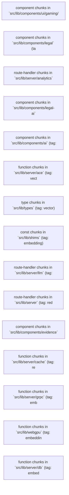

# Codebase Map

Generated: 2026-05-08T16:20:53.620Z

- **300** file notes
- **100** clusters
- **n/a** route methods

## Visualization

- **Graph View** (vanilla): toggle tag coloring to see cluster membership
- **Canvas**: open `codebase.canvas` for spatial cluster map
- **Extended Graph plugin** (recommended for 3k+ nodes): `ElsaTam/obsidian-extended-graph`

## Top 15 Clusters (Mermaid)

## Cluster Index

- [[Clusters/cluster-50|component chunks in `src/lib/components/ui/gaming/n64` (tag: page)]] (3814 members)
- [[Clusters/cluster-21|component chunks in `src/lib/components/legal` (tag: auth)]] (2980 members)
- [[Clusters/cluster-70|route-handler chunks in `src/lib/server/analytics` (tag: embedding)]] (1546 members)
- [[Clusters/cluster-35|component chunks in `src/lib/components/legal-ai` (tag: component)]] (1392 members)
- [[Clusters/cluster-5|component chunks in `src/lib/components/ai` (tag: ai)]] (1280 members)
- [[Clusters/cluster-72|function chunks in `src/lib/server/ace` (tag: vector)]] (1186 members)
- [[Clusters/cluster-74|type chunks in `src/lib/types` (tag: vector)]] (1122 members)
- [[Clusters/cluster-57|const chunks in `src/lib/shims` (tag: embedding)]] (1099 members)
- [[Clusters/cluster-44|route-handler chunks in `src/lib/server/llm` (tag: api)]] (1062 members)
- [[Clusters/cluster-25|route-handler chunks in `src/lib/server` (tag: redis)]] (974 members)
- [[Clusters/cluster-92|component chunks in `src/lib/components/evidence` (tag: embedding)]] (940 members)
- [[Clusters/cluster-94|function chunks in `src/lib/server/cache` (tag: redis)]] (921 members)
- [[Clusters/cluster-82|function chunks in `src/lib/server/grpc` (tag: embedding)]] (903 members)
- [[Clusters/cluster-20|function chunks in `src/lib/webgpu` (tag: embedding)]] (883 members)
- [[Clusters/cluster-6|function chunks in `src/lib/server/db` (tag: embedding)]] (700 members)