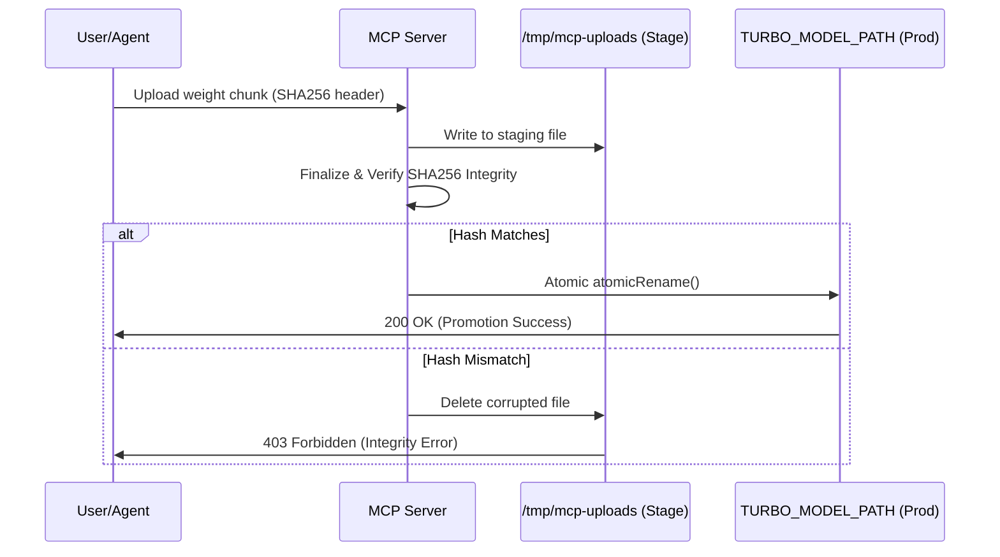

# Quantization & GPU Performance Reference — Deeds Web App

This reference guide details the high-performance inference stack used for Hermes and ACE retrieval, focusing on quantization methods, CUDA orchestration patterns, and security-hardened model ingestion.

## 1. Quantization Technology Comparison

| Method | Bits | Key Mechanism | Gemma 4 Safe? | Availability |
|--------|------|---------------|---------------|-------------|
| **RotorQuant IQ4_XS** | 4-bit | Block-diagonal rotations, IQ4_XS GGUF format | **Yes** (stock binary) | `majentik/gemma-4-E4B-RotorQuant-GGUF-IQ4_XS` |
| **AtomicBot TurboQuant** | 3-bit K+V | turbo3/turbo3 + MTP speculative (`--mtp-head`) | **Yes** (D=256/512 aware) | `AtomicBot-ai/atomic-llama-cpp-turboquant-binaries` |
| **TurboQuant (Google ICLR)** | 3–4-bit | PolarQuant (random rotation) + QJL residual correction | Needs D=256/512 kernels | `test1111` fork source build |
| **TurboVec** | 2–4-bit | TurboQuant algorithm on embeddings (Rust/Python) | N/A (embeddings only) | `pip install turbovec` |
| **scrya RotorQuant** | 3-bit | Block-diagonal 2D/4D rotations (PlanarQuant/IsoQuant) | **Yes** | Source build; superior PPL |

### Performance Benchmarks (RTX 3060 Ti / 8GB)
- **RotorQuant IQ4_XS**: 28% faster decode, 5.3× faster prefill vs. TurboQuant baseline.
- **TurboQuant (turbo3)**: 4.3× KV compression; +30–50% throughput on short prompts via Speculative Decoding.

---

## 2. CUDA Graph Capture Pattern

To achieve zero-overhead kernel dispatch for static-shape tensors (e.g., attention scoring, reranking), use the following capture pattern in `simd-bridge/cpp/libtorch_graph.cc`.

```cpp
// 1. Initialize Graph
cudaGraph_t graph;
cudaGraphExec_t instance;
bool graphCaptured = false;

void runAttentionKernel(float* query, float* keys, int n, int dim) {
    if (!graphCaptured) {
        // 2. Start Capture
        cudaStreamBeginCapture(stream, cudaStreamCaptureModeGlobal);
        
        // --- Warmup / Capture Operations ---
        launch_attention_kernel<<<grid, block, 0, stream>>>(query, keys, n, dim);
        // ------------------------------------
        
        // 3. End Capture
        cudaStreamEndCapture(stream, &graph);
        cudaGraphInstantiate(&instance, graph, NULL, NULL, 0);
        graphCaptured = true;
    }
    
    // 4. Executable Launch
    cudaGraphLaunch(instance, stream);
    cudaStreamSynchronize(stream);
}
```

---

## 3. Weight Formats & Compatibility

### GGUF (RotorQuant)
- **Format**: `IQ4_XS` (I-matrix Quantization).
- **Driver**: Stock `llama-server.exe` (llama.cpp).
- **Pros**: Zero-configuration, native GGUF support, high PPL stability.

### Turbopack (Custom)
- **Format**: `turbo3` / `turbo4`.
- **Driver**: AtomicBot custom build.
- **Pros**: Hardware-specific D=256/512 kernels for Gemma 4. Enables `--mtp-head` for speculative decoding.

---

## 4. MCP Weight-Upload Security Workflow

To ensure production stability, weight ingestion follows an atomic, verified promotion pipeline.



---

## 5. WebGPU WGSL Reranker

Browser-side reranking offloads scoring from the GPU server to the client's local GPU using WebGPU/WGSL.

### WGSL Cross-Attention Shader
```wgsl
@group(0) @binding(0) var<storage, read> queryEmbed: array<f32>;
@group(0) @binding(1) var<storage, read> candidateEmbeds: array<f32>;
@group(0) @binding(2) var<storage, read_write> scores: array<f32>;

@compute @workgroup_size(64)
fn main(@builtin(global_invocation_id) global_id: vec3<u32>) {
    let chunkIdx = global_id.x;
    let dim = 768u;
    
    var dot: f32 = 0.0;
    for (var i = 0u; i < dim; i++) {
        dot += queryEmbed[i] * candidateEmbeds[chunkIdx * dim + i];
    }
    
    scores[chunkIdx] = dot; // Normalized cosine sim
}
```

---

## 📋 Recommended Progression (RTX 3060 Ti)

1.  **L1 (Immediate)**: Download `majentik/gemma-4-E4B-RotorQuant-GGUF-IQ4_XS`. Point `TURBO_MODEL_PATH` at it. Use `TURBO_PROFILE=stock`.
2.  **L2 (Performance)**: Switch to `AtomicBot-ai/atomic-llama-cpp-turboquant-binaries`. Set `LLAMA_SERVER_PATH`. Enable `-ctk turbo3 -ctv turbo3` + `--mtp-head`.
3.  **L3 (Precision)**: Source-build `scrya-com/rotorquant` for maximum Perplexity (PPL) stability in legal reasoning tasks.
