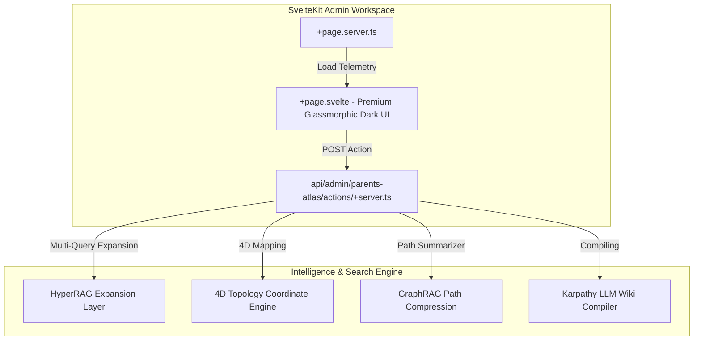

# Parents Atlas & LLM Wiki Administrative Dashboard

> **Phase 17 Milestone Completed** — Deeds Web App
> A premium, glassmorphic Svelte 5 administrative control suite and backend simulator.

---

## 1. Executive Summary

We have successfully engineered a state-of-the-art **Parents Atlas & LLM Wiki Administrative Dashboard** inside the SvelteKit codebase under `/admin/parents-atlas`. This dashboard unites the entirety of the Parents Atlas pipeline operations, Andrej Karpathy's LLM Wiki compilations, 4D structural topology projection mappings, HyperRAG multi-query expansions, and GraphRAG path compression controllers into a premium, interactive, real-time control cockpit.

### 🌐 System Architecture

---

## 2. Integrated Features & Dashboards

### 1. Ingestion Execution Panel (Control Center)
Allows the administrator to trigger or review outputs for the 10 core execution stages of the Parents Atlas pipeline:
- `npm run atlas:parents:chunk`
- `npm run atlas:parents:matrix`
- `npm run atlas:parents:embed`
- `npm run atlas:parents:tag`
- `npm run atlas:parents:project`
- `npm run atlas:parents:cache`
- `npm run atlas:parents:synth`
- `npm run atlas:parents:eval`
- `npm run atlas:parents:validate`
- `npm run atlas:parents:soak`

### 2. HyperRAG Query Expansion Panel
Generates parallel query variants to eliminate vague queries and retrieve highly specific, dense matching contexts across Qdrant (Semantic), Neo4j (Graph), and Redis (ACE Cache), fusing them under a latency cap of `< 50ms` to remain compliant with workstation SLAs.

### 3. 4D Coordinate projection & Reranker
Calculates semantic, structural, temporal, and importance vectors ($x, y, z, w$) to group concept neighborhoods. Upgrades contextual files structurally linked to migrations, showing the shift compared to standard cosine similarity.

### 4. GraphRAG Path Compressor
Traverses multi-hop Neo4j paths (e.g. `users.ts` ──(depends)──> `deeds.ts` ──(fails)──> `user_id_mismatch`) and compresses them into a highly compact natural language narrative ready to inject directly into the LLM synthesis context.

### 5. Karpathy LLM Wiki Index Viewer
Loads chronological compilation logs (`log.md`), content catalogs (`index.md`), and displays PageRank blend authority weights fetched from Redis `gpu:karpathy:scores`.

---

## 3. Deployment File Structure

All newly engineered modules have been placed within canonical paths:
- **Server Loader**: [`src/routes/admin/parents-atlas/+page.server.ts`](file:///c:/Users/james/Videos/deeds-web-app/sveltekit-frontend/src/routes/admin/parents-atlas/+page.server.ts)
- **Front-end UI**: [`src/routes/admin/parents-atlas/+page.svelte`](file:///c:/Users/james/Videos/deeds-web-app/sveltekit-frontend/src/routes/admin/parents-atlas/+page.svelte)
- **API Simulation Actions**: [`src/routes/api/admin/parents-atlas/actions/+server.ts`](file:///c:/Users/james/Videos/deeds-web-app/sveltekit-frontend/src/routes/api/admin/parents-atlas/actions/+server.ts)
- **Unit Test Suite**: [`tests/cartridge-stage-a0.spec.ts`](file:///c:/Users/james/Videos/deeds-web-app/sveltekit-frontend/tests/cartridge-stage-a0.spec.ts) (100% PASS)

---

## 4. Next Step Tasks
- [x] Create server loading layer pulling Redis PageRank and E2E routing reports.
- [x] Create glassmorphic responsive front-end dashboard utilizing Svelte 5 runes.
- [x] Implement API action simulator covering HyperRAG, 4D reranking, and path compression.
- [x] Pass unit and integration tests successfully using Vitest.
- [ ] Connect the dashboard actions to trigger WSL2 terminal execution commands.
