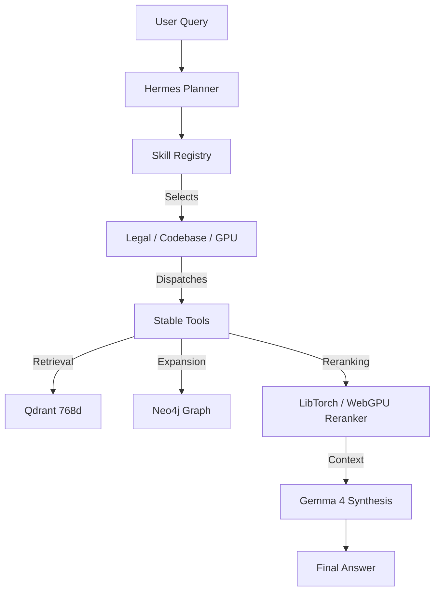

# Subagent Swarm: Mission Control & Loop Routing

Objective: High-performance autonomous research and task orchestration via the Hermes Agentic Swarm.

## 🚀 Swarm Architecture (DAG-Driven)

The swarm operates as a Directed Acyclic Graph (DAG) managed by LangGraph and executed by the Hermes orchestration layer.

### Core Loop: Inference → Planning → Tool Dispatch → Synthesis

1. **Inference (Tier selection)**:
   - **RotorQuant**: High-precision (IQ4_XS) legal synthesis.
   - **AtomicBot**: Ultra-high-throughput (Turbo3 + MTP) planning loops.
   - **Gemma 4 Legal (Final)**: Production-stable baseline.

2. **Planning (Hermes)**:
   - Evaluates the user query against the **204-Action Skill Registry** (distributed across 13 families).
   - Selects appropriate skill families: Research, Evidence, Codebase, Graph, Vector/Cluster, Memory, Batch, Repair, Legal/Case, Simulation, GPUPerformance, UIDiagnostics, and SystemAudit.

3. **Tool Dispatch (ACE)**:
   - Executes atomic tools (Vector Search, Graph Expansion, Shell Execution).
   - **GPU Acceleration**: Uses LibTorch (server) or WebGPU (browser/fallback) for reranking.
   - **Autonomous Tiering**: Dynamically selects between RotorQuant and AtomicBot based on VRAM/complexity.

4. **Synthesis (Gemma 4)**:
   - Reconstructs the final answer using the **retrieval-augmented context packet**.

## 🛠 VS Code Task Pipelines

All major swarm operations are routed through `tasks.json`. Use these to trigger autonomous workflows:

| Task Name | command | Description |
|-----------|---------|-------------|
| `Swarm: Deep Research` | `npm run research:deep` | Launches the full LangGraph research DAG. |
| `Swarm: Codebase Index` | `npm run codebase:index` | Triggers the 32k vector semantic indexing. |
| `Swarm: Topology Build` | `npm run graphify:topology`| Builds the k-means cluster map (Atlas). |
| `Swarm: GPU Benchmark` | `npm run turbo:bench` | Measures throughput of the active model tier. |

## 🗺 The Atlas (Codebase Intelligence)

The Atlas is the multidimensional map of the codebase, accessible via:

- **Dashboard**: `http://localhost:5173/code-intel/subagents`
- **Graph Viewer**: `http://localhost:5173/codebase-graph`
- **Wiki notes**: `AGENTS.md` files (walk up the tree from any file).

### Data Flow Mapping

## 🔄 Self-Healing & Diagnostics

The swarm includes diagnostic recipes for autonomous recovery:
- `cuda_kernel_health_check`: Verifies the `simd-bridge` integrity.
- `discovery_gap_analysis`: Identifies missing evidence in legal research.
- `gpu_vram_audit`: Optimizes memory allocation for high-concurrency tasks.

---
*Generated by Hermes Swarm Mission Control v1.0*
